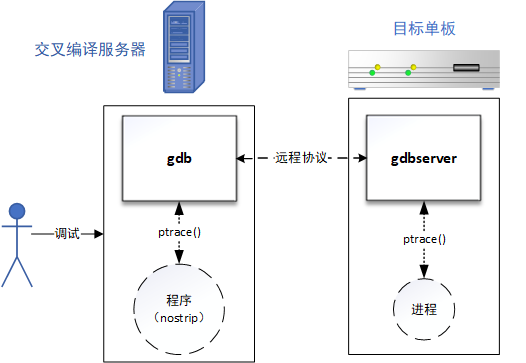

# gdbserver + [cross-compiler]gdb

在学校做单片机或者嵌入式的时候，往往可以对自己的程序进行直接的 *gdb*/*JTAG* 调试，而工作后，往往是编译服务器的形式进行编程和编译，而所面对的嵌入式设备也资源非常紧张，很难支持直接使用 *gdb+可执行程序运行* 的方式，所以应用更多的是 *gdbserver* 远程调试设备。这两个工具的源码下载路径为 http://ftp.gnu.org/gnu/gdb/ 。

### 原理说明



如上图所示，在真实的工程应用场景中，往往是通过远程协议的方式，进行 *ptrace* 的数据传递，从而间接实现对远程设备的调试。

### 编译方式

这里以 *海思3536*（交叉编译链前缀是 *arm-hisiv400_v2-linux*）编译 *gdb-7.6* 为例，命令如下：

```shell
$ cd gdb-7.6
$ mkdir out
$ ./configure --target=arm-hisiv400_v2-linux --host=arm-hisiv400_v2-linux --prefix=$PWD/out CC=arm-hisiv400_v2-linux-gcc --disable-werror
$ make
$ make install
```

在编译过程中可能会遇到：

```shell
linux-arm-low.c:328:1: error: conflicting types for 'ps_get_thread_area'
```

类似的错误，原因在于有些交叉编译器的头文件内定义了重复接口，所以删除编译器提示的 *gdb源码中的定义* 即可。

### 使用方式

目标单板上运行前面交叉编译得到的 *gdbserver*，需提前选择好一个不使用的端口，以 *1666* 为例的运行命令如下：

```shell
# ./gdbserver --multi 127.0.0.1:1666 &
# ifconfig
eth1: flags=4163<UP,BROADCAST,RUNNING,MULTICAST>  mtu 1500
        inet 192.168.1.199  netmask 255.255.255.0  broadcast 192.168.1.255
        ...
# ps
  PID TTY          TIME CMD
  ...
 2433 tty1     00:00:00 ./gdbserver --multi 127.0.0.1:1666
 2455 tty1     00:00:00 main
 2488 tty1     00:00:00 ps
# mkdir /mnt/nfs
# mount -t nfs 192.168.1.100:/nfs /mnt/nfs -o nolock
# cp -drf /lib /mnt/nfs/
```

在启动 *gdbserver* 后，为了后续的远程连接的参数做准备，还需要：

1. 通过 *ifconfig* 获取目标单板的 *IP*

2. 通过 *ps* 获取待调试的进程名和 *PID*

3. 通过 *nfs* （或其他方式）拷贝lib到交叉编译服务器上

交叉编译服务器上通过交叉编译器的 *gdb*（一般交叉编译环境均有）连接目标单板并进行调试，运行命令如下：

```shell
$ cat gdbinit.cfg
handle SIGINT stop
handle SIGPIPE nostop
set solib-search-path ./lib
$ arm-hisiv400_v2-linux-gdb main -x gdbinit.cfg -ex "target extended-remote 192.168.1.199:1666" -ex "attach 2455" -ex "c"
```

为了方便一个命令直接创造出 *gdb* 环境，这里使用 *-x gdbinit.cfg* 的方式，将运行 *gdb* 后需要的必要命令放入其中。在运行完 *arm-hisiv400_v2-linux-gdb* 命令后就完成了远程的连接，后续只需要按照 *gdb* 调试一样使用 *gdb内部命令* 调试即可。

