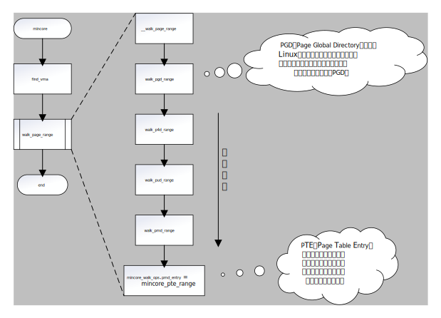

# vmtouch

### Content

- [简介](#简介)

- [原理](#原理)
- [编译](#编译)
- [使用](#使用)

---

### 简介

在工程应用上，难免会因为应用开发人员的不专业，造成某种情况下系统 *cache* 的异常增多，从而导致 *OOM* 问题的发生。而系统的 *cache* 通常由文件系统和共享内存两部分组成，本节提到的 *vmtouch* 工具主要针对于更难排查的文件系统，共享内存的增加是可以根据 */proc/sysvipc/shm* 、钩子函数等方式进行排查的。vmtouch的源码下载链接为 https://github.com/hoytech/vmtouch 。

---

### 原理

从源码上看，其原理可以用三个函数概括：

```c
void vmtouch_file(char *path) {
  ...
  fd = open(path, open_flags, 0);
  ...
  mem = mmap(NULL, len_of_range, PROT_READ, MAP_SHARED, fd, offset);
  if (o_evict) {
    ...
  } else {
    ...
    if (mincore(mem, len_of_range, (void*)mincore_array)) fatal("mincore %s (%s)", path, strerror(errno));
    ...
  }
}
```

其核心为`mincore`这一系统调用，它的处理如下：



在文件映射到 *vmtouch* 所在进程内存后，通过层层递进访问页表，最终访问至页表项判断物理页是否存在。

---

### 编译

由于 *vmtouch* 的文件和编译结构很简单，因此只需要修改 *Makefile* 中的一行即可实现交叉编译：

```makefile
CC =		arm-hisiv400_v2-linux-gcc
```

如上是编译 *海思3536* 的一个修改例子，只需要设置`CC`变量即可。

---

### 使用

```shell
$ vmtouch test.txt
           Files: 1
     Directories: 0
  Resident Pages: 4950/42116  19M/164M  11.8%
         Elapsed: 0.006706 seconds
$ vmtouch /bin/
           Files: 92
     Directories: 1
  Resident Pages: 348/1307  1M/5M  26.6%
         Elapsed: 0.003426 seconds
```

主要关注 *Resident Pages* 这一项，前面的值为 *cache* 占用着的物理内存大小。

