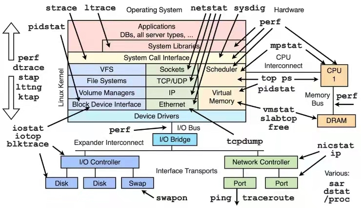

# 工欲善其事，必先利其器

在工程应用上，很多时候会面对较为复杂的bug，此时若有一些工具可以协助往下挖更多的信息，往往将是事半功倍的。下面先展示一幅业内流传的“debug工具分布图”：

实际上，自己也没全用过，但是接下来也不妨可以按照这个图的模块作为参照，对一些工具给大家进行科普。应用层这边的工具可能会介绍地更多一些，毕竟更接近自身的工作。

### [Applications](./Applications)

- [*gdbserver + [cross-compiler]gdb*](./Applications/gdb+gdbserver/Readme.md)
- [*pstack*](https://github.com/CallonHuang/EngineerLinux/tree/master/Debugging%20tools/Applications/pstack)
- *sigaction + backtrace + backtrace_symbols*
- *valgrind*
- *tcmalloc*
- *ASAN（Address-Sanitizier）*

### [System Libraries](https://github.com/CallonHuang/EngineerLinux/tree/master/Debugging%20tools/System%20Libraries)

- [*ltrace*](https://github.com/CallonHuang/EngineerLinux/tree/master/Debugging%20tools/System%20Libraries/ltrace)

### [System Call Interface](https://github.com/CallonHuang/EngineerLinux/tree/master/Debugging%20tools/System%20Call%20Interface)

- [*strace*](https://github.com/CallonHuang/EngineerLinux/tree/master/Debugging%20tools/System%20Call%20Interface/strace)

### [Linux Kernel Module](https://github.com/CallonHuang/EngineerLinux/tree/master/Debugging%20tools/Linux%20Kernel%20Module)

- [*vmtouch*](https://github.com/CallonHuang/EngineerLinux/tree/master/Debugging%20tools/Linux%20Kernel%20Module/vmtouch)
- *perf*
- *sysrq*

