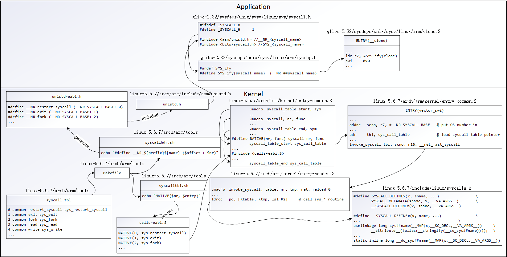
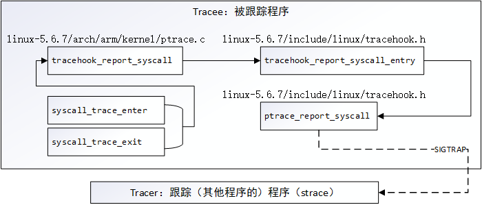
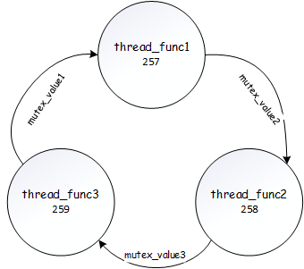

# strace

在工程应用中，经常会遇到死锁和CPU占用异常的问题，*strace* 则是在这些方面大方异彩的一个工具。其功能主要是跟踪系统调用，而由于 *Linux* 系统中死锁一般会调用到 *futex* 系统调用，且很多CPU异常占用问题都在于对系统调用无限制地调用导致，因而它一直作为这些问题处理过程中一个几乎必用的工具。

源码路径位于： https://github.com/strace/strace/releases 。

### 原理

为了更好地说明 *strace* 跟踪系统调用的原理，下面将先以 *arm* 平台为例分析下系统调用本身的实现机制。

如果之前有看过 *Memory/HiddenOOM/ThreadStackLeaked* 这一节的朋友可能还记得，通常情况下应用程序所使用的 *clone* 函数并不是 *clone* 系统调用，而是 *glibc* 封装过的一段汇编代码实现的 *clone*，这段汇编代码间接地调用了真正的 *clone* 系统调用，那么从这个点展开看下系统调用的过程吧。



这是一幅通过 *glibc* 和 *linux内核* 源码分析后得出的图，其中汇编代码中比较晦涩的当属 *syscall_table_start / syscall / syscall_table_end* 这几个汇编宏，因而这里采用等价的一组 *C* 语言来简单解释：

```c
#define syscall_table_start(table) void *table[NR_syscalls] = { \
			[0 ... NR_syscalls-1] = sys_ni_syscall,

#define syscall_table_end(table) };
#define syscall(nr, func) [nr] = (call),
#define NATIVE(nr, func) syscall(nr, func)

syscall_table_start(sys_call_table)
#include <calls-eabi.S>
syscall_table_end(sys_call_table)
```

从上述等价 *C* 代码就不难看出，实际上这些宏的展开就是 *sys_call_table* 这一变量的声明和初始化。

简单总结下就是：**系统调用原理是软中断（*arm* 平台为汇编指令 *swi*），通过中断从用户态切换到内核态，通过固定寄存器（*arm* 平台为 *r7*）来传递系统调用编号，最后内核在向量表中找到编号所对应的函数 *sys_xxx***。

最终的系统调用函数图中并未列出，因为所有代码中用到 *SYSCALL_DEFINEx* 的都是其函数体，分散在了各个模块中。

上面说了一大堆还是系统调用的原理，那 *strace* 要如何去跟踪它呢？

下面不妨再将内核源码 *entry-common.S* 中的 *vector_swi* 多展开一些：

```c
	...
	addne	scno, r7, #__NR_SYSCALL_BASE	@ put OS number in
	...
	adr	tbl, sys_call_table		@ load syscall table pointer
	...
	tst	r10, #_TIF_SYSCALL_WORK		@ are we tracing syscalls?
	bne	__sys_trace
	invoke_syscall tbl, scno, r10, __ret_fast_syscall
	...
__sys_trace:
	mov	r1, scno
	add	r0, sp, #S_OFF
	bl	syscall_trace_enter
	mov	scno, r0
	invoke_syscall tbl, scno, r10, __sys_trace_return, reload=1
	cmp	scno, #-1			@ skip the syscall?
	bne	2b
	add	sp, sp, #S_OFF			@ restore stack

...
__sys_trace_return:
	str	r0, [sp, #S_R0 + S_OFF]!	@ save returned r0
	mov	r0, sp
	bl	syscall_trace_exit
	b	ret_slow_syscall
```

而 *syscall_trace_enter* 和 *syscall_trace_exit* 的实现就在 *linux-5.6.7/arch/arm/kernel/ptrace.c* 中了：

```c
asmlinkage int syscall_trace_enter(struct pt_regs *regs, int scno)
{
	current_thread_info()->syscall = scno;
	if (test_thread_flag(TIF_SYSCALL_TRACE))
		tracehook_report_syscall(regs, PTRACE_SYSCALL_ENTER);
	...
	/* Tracer or seccomp may have changed syscall. */
	scno = current_thread_info()->syscall;
	if (test_thread_flag(TIF_SYSCALL_TRACEPOINT))
		trace_sys_enter(regs, scno);
	audit_syscall_entry(scno, regs->ARM_r0, regs->ARM_r1, regs->ARM_r2,
			    regs->ARM_r3);
	return scno;
}

asmlinkage void syscall_trace_exit(struct pt_regs *regs)
{
	audit_syscall_exit(regs);
	if (test_thread_flag(TIF_SYSCALL_TRACEPOINT))
		trace_sys_exit(regs, regs_return_value(regs));
	if (test_thread_flag(TIF_SYSCALL_TRACE))
		tracehook_report_syscall(regs, PTRACE_SYSCALL_EXIT);
}

```

这样就能知道，*strace* 的底层必然就是利用了 *ptrace* 的特性追溯到了系统调用开始和结束的过程，而 *ptrace* 的追溯原理可由如下图进一步解释：



- 调用 *syscall_trace_enter* 后，*Tracee* 将收到 *SIGTRAP* 信号，然后停止执行，而 *Tracer* 则会收到通知说有信号待处理。接下来 *Tracer* 就可以查看 *Tracee* 的状态，打印寄存器的值、时间戳等等信息。

- 相应地，调用 *syscall_trace_exit* 后，也将通过相同的路径来让 *Tracer* 获取返回值、时间戳等等信息。

### 编译

这里以 *海思3536* 编译 *strace-5.0* 为例，命令如下：

```shell
$ ./configure ARCH=arm CROSS_COMPILE=arm-hisiv400_v2-linux --host=arm-linux CC=arm-hisiv400_v2-linux-gcc LD=arm-hisiv400_v2-linux-ld
$ make
```

在 *make* 完成后，就能在根目录下得到对应的 *strace* 可执行文件，由于默认是动态链接的，因此若出现运行时缺少库的问题，则需要额外从交叉编译器对应的库路径中找到缺少的库文件并拷贝到设备中。

### 使用

常用的几个 *strace* 选项如下：

- *-tt* ：在每行输出的前面，显示毫秒级别的时间
- *-T* ：显示每次系统调用所花费的时间
- *-p* ：指定要跟踪的tid/pid
- *-f* ：跟踪目标进程，以及目标进程创建的所有子进程

- *-c* ：统计每一系统调用的所执行的时间，次数和出错的次数等

```shell
$ strace -tt -T -f -p $PID
$ strace -c -f -p $PID
$ strace -c -f process
```

注：*-t* / *-T* has no effect with *-c* .

这里将以 *code* 文件夹中给出的卡死问题为例，使用 *strace* 来追溯死锁环：

```shell
$ ./main &
<for a while...>
$ ps -T
  PID  SPID TTY          TIME CMD
    8     8 tty1     00:00:01 bash
  256   256 tty1     00:00:00 main
  256   257 tty1     00:00:00 thread_func1
  256   258 tty1     00:00:00 thread_func2
  256   259 tty1     00:00:00 thread_func3
  273   273 tty1     00:00:00 ps
$ strace -p 257
strace: Process 257 attached
futex(0x7f1255801080, FUTEX_WAIT_PRIVATE, 2, NULL^Cstrace: Process 257 detached
<detached ...>
$ gdb -p 256
...
(gdb) p *(int *)(0x7f1255801080+2*sizeof(int))
$1 = 258
(gdb) quit
A debugging session is active.

        Inferior 1 [process 256] will be detached.

Quit anyway? (y or n) y
Detaching from program: /mnt/d/linux/git/EngineerLinux/Debugging tools/System Call Interface/strace/code/main, process 256
$ strace -p 258
strace: Process 258 attached
futex(0x7f12558010c0, FUTEX_WAIT_PRIVATE, 2, NULL^Cstrace: Process 258 detached
<detached ...>
$ gdb -p 256
...
(gdb) p *(int *)(0x7f12558010c0+2*sizeof(int))
$1 = 259
(gdb) quit
A debugging session is active.

        Inferior 1 [process 256] will be detached.

Quit anyway? (y or n) y
Detaching from program: /mnt/d/linux/git/EngineerLinux/Debugging tools/System Call Interface/strace/code/main, process 256
$ strace -p 259
strace: Process 259 attached
futex(0x7f1255801040, FUTEX_WAIT_PRIVATE, 2, NULL^Cstrace: Process 259 detached
<detached ...>
$ gdb -p 256
...
(gdb) p *(int *)(0x7f1255801040+2*sizeof(int))
$1 = 257
(gdb) quit
A debugging session is active.

        Inferior 1 [process 256] will be detached.

Quit anyway? (y or n) y
Detaching from program: /mnt/d/linux/git/EngineerLinux/Debugging tools/System Call Interface/strace/code/main, process 256
```

首先，*strace* 之所以可以排查死锁问题，原因在于 *mutex* 锁的结构定义：

```c
typedef union
{
  struct __pthread_mutex_s
  {
    int __lock;
    unsigned int __count;
    int __owner;
#if __WORDSIZE == 64
    unsigned int __nusers;
#endif
    /* KIND must stay at this position in the structure to maintain
       binary compatibility.  */
    int __kind;
#if __WORDSIZE == 64
    int __spins;
    __pthread_list_t __list;
# define __PTHREAD_MUTEX_HAVE_PREV      1
#else
    unsigned int __nusers;
    __extension__ union
    {
      int __spins;
      __pthread_slist_t __list;
    };
#endif
  } __data;
  char __size[__SIZEOF_PTHREAD_MUTEX_T];
  long int __align;
} pthread_mutex_t;
```

其结构的 *__owner* 成员保存着当前锁的拥有者的 *PID/TID* ，从而只需要知道锁的地址便可以使用 *gdb* 打印出锁的拥有者，从而一步步往上追溯死锁环。

此时再来看例子中排查死锁的过程：

1. *strace* 查看 *thread_func1* 线程，发现其在等待地址为 *0x7f1255801080* 的锁，同时通过 *gdb* 打印出该锁 *__owner* 的 *TID* 为 *258*，即该锁被 *thread_func2* 线程占用；
2. *strace* 查看 *thread_func2* 线程，发现其在等待地址为 *0x7f12558010c0* 的锁，同时通过 *gdb* 打印出该锁 *__owner* 的 *TID* 为 *259*，即该锁被 *thread_func3* 线程占用；
3. *strace* 查看 *thread_func3* 线程，发现其在等待地址为 *0x7f1255801040* 的锁，同时通过 *gdb* 打印出该锁 *__owner* 的 *TID* 为 *257*，即该锁被 *thread_func1* 线程占用；

此时，死锁环就完整地展现在了排查人员的面前：

