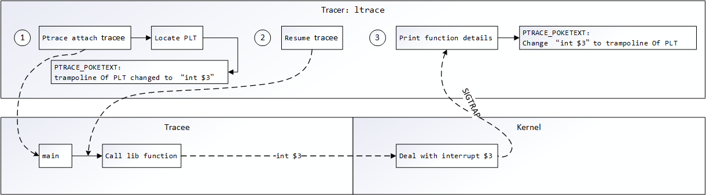

# ltrace

### Content

- [简介](#简介)

- [原理](#原理)
- [编译](#编译)
- [使用](#使用)

---

### 简介

*ltrace* 是一款用于跟踪库函数调用的工具，在工程应用中一般用于在不重编可执行程序的情况下，对库函数调用相关问题进行排查/优化。与 *strace* 较为类似，但是使用频次上还是远不如 *strace* 的。

---

### 原理

*ltrace* 是一个（函数）库调用跟踪器（*library call tracer*），虽然也是基于 *ptrace* ，但是跟踪库函数和跟踪系统调用的差别还是很大的，这就是为什么 *ltrace* 是一个独立的工具而不是融于 *strace* 之中的原因。

为了方便后续的内容，这里将先从动态库函数加载到程序中的过程来剖析。这里牵涉到两个概念 *GOT*（*Global Offset Table*）和 *PLT*（*Procedure Linkage Table*）：

- *GOT*：译为全局偏移表，「链接器」为「外部符号」填充的实际偏移表
- *PLT*：译为程序链接表，它有两个功能，要么在 *GOT* 中拿到地址并跳转，要么当 *GOT* 没有所需地址的时，触发「链接器」去找到所需地址

为了更直观地看到这个过程，可以根据 *code* 文件夹中的程序一起走一遍如下流程：

```shell
$ gcc -m32 -no-pie -g -o plt main.c
$ ./plt
-bash: ./plt: 无法执行二进制文件: 可执行文件格式错误
$ gcc -m64 -no-pie -g -o plt main.c
```

由于*32*位的程序运行的话得到的地址是绝对的，*64*位运行只能看到相对量，因此不妨优先考虑 *-m32* 来尝试，只有失败时再去老老实实使用*64*位来编译运行吧。

在调试前可以使用 *objdump* 对 *GOT* 和 *PLT* 有个概览：

```shell
$ objdump -h plt

plt：     文件格式 elf64-x86-64

节：
Idx Name          Size      VMA               LMA               File off  Algn
...
 11 .plt          00000030  0000000000400420  0000000000400420  00000420  2**4
                  CONTENTS, ALLOC, LOAD, READONLY, CODE
...
 20 .got          00000010  0000000000600ff0  0000000000600ff0  00000ff0  2**3
                  CONTENTS, ALLOC, LOAD, DATA
 21 .got.plt      00000028  0000000000601000  0000000000601000  00001000  2**3
                  CONTENTS, ALLOC, LOAD, DATA
...
```

>  其中，*.got.plt* 是 *GOT* 专门为 *PLT* 准备的节，*PLT* 就是首先从这里来尝试拿到地址的。

为了更方便后面的调试，需要再安装下 *pwndbg* 这一工具：

```shell
$ git clone https://github.com/pwndbg/pwndbg
$ cd pwndbg/
$ sudo ./setup.sh
```

完成后开始调试分析整个过程：

```assembly
$ gdb plt
...
pwndbg: loaded 188 commands. Type pwndbg [filter] for a list.
pwndbg: created $rebase, $ida gdb functions (can be used with print/break)
Reading symbols from plt...done.
pwndbg> disass main
Dump of assembler code for function main:
   0x0000000000400537 <+0>:     push   rbp
   0x0000000000400538 <+1>:     mov    rbp,rsp
   0x000000000040053b <+4>:     sub    rsp,0x10
   0x000000000040053f <+8>:     mov    DWORD PTR [rbp-0x4],edi
   0x0000000000400542 <+11>:    mov    QWORD PTR [rbp-0x10],rsi
   0x0000000000400546 <+15>:    lea    rdi,[rip+0xa7]        # 0x4005f4
   0x000000000040054d <+22>:    call   0x400430 <puts@plt>
   0x0000000000400552 <+27>:    lea    rdi,[rip+0xa8]        # 0x400601
   0x0000000000400559 <+34>:    call   0x400430 <puts@plt>
   0x000000000040055e <+39>:    mov    edi,0x0
   0x0000000000400563 <+44>:    call   0x400440 <exit@plt>
End of assembler dump.
pwndbg> b *0x400430
Breakpoint 1 at 0x400430
```

先通过 *disass/disassemble* 命令，找到 *call put* 的地址，并用 *b *0x400430* 在其入口设置上断点，*run* 运行等待断点命中。

```assembly
pwndbg> run
Starting program: /xxx/plt

Breakpoint 1, 0x0000000000400430 in puts@plt ()
...
───────────────────────────────────────────────────────[ DISASM ]───────────────────────────────────────────────────────
 ► 0x400430       <puts@plt>                         jmp    qword ptr [rip + 0x200be2] <0x601018>

   0x400436       <puts@plt+6>                       push   0
   0x40043b       <puts@plt+11>                      jmp    0x400420 <0x400420>
    ↓
   0x400420                                          push   qword ptr [rip + 0x200be2] <0x601008>
   0x400426                                          jmp    qword ptr [rip + 0x200be4] <_dl_runtime_resolve_xsavec>
    ↓
   0x7fffff4178f0 <_dl_runtime_resolve_xsavec>       push   rbx
   0x7fffff4178f1 <_dl_runtime_resolve_xsavec+1>     mov    rbx, rsp
   0x7fffff4178f4 <_dl_runtime_resolve_xsavec+4>     and    rsp, 0xffffffffffffffc0
   0x7fffff4178f8 <_dl_runtime_resolve_xsavec+8>     sub    rsp, qword ptr [rip + 0x211f09] <0x7fffff629808>
   0x7fffff4178ff <_dl_runtime_resolve_xsavec+15>    mov    qword ptr [rsp], rax
   0x7fffff417903 <_dl_runtime_resolve_xsavec+19>    mov    qword ptr [rsp + 8], rcx
...
─────────────────────────────────────────────────────[ BACKTRACE ]──────────────────────────────────────────────────────
 ► f 0           400430 puts@plt
   f 1           400552 main+27
   f 2     7fffff021bf7 __libc_start_main+231
────────────────────────────────────────────────────────────────────────────────────────────────────────────────────────
pwndbg>
```

此时若使用 *si* 命令进入 *puts* 函数将出现如下结果：

```assembly
pwndbg> si
0x0000000000400436 in puts@plt ()
...
───────────────────────────────────────────────────────[ DISASM ]───────────────────────────────────────────────────────
   0x400430       <puts@plt>                         jmp    qword ptr [rip + 0x200be2] <0x601018>

 ► 0x400436       <puts@plt+6>                       push   0
   0x40043b       <puts@plt+11>                      jmp    0x400420 <0x400420>
    ↓
   0x400420                                          push   qword ptr [rip + 0x200be2] <0x601008>
   0x400426                                          jmp    qword ptr [rip + 0x200be4] <_dl_runtime_resolve_xsavec>
    ↓
   0x7fffff4178f0 <_dl_runtime_resolve_xsavec>       push   rbx
   0x7fffff4178f1 <_dl_runtime_resolve_xsavec+1>     mov    rbx, rsp
   0x7fffff4178f4 <_dl_runtime_resolve_xsavec+4>     and    rsp, 0xffffffffffffffc0
   0x7fffff4178f8 <_dl_runtime_resolve_xsavec+8>     sub    rsp, qword ptr [rip + 0x211f09] <0x7fffff629808>
   0x7fffff4178ff <_dl_runtime_resolve_xsavec+15>    mov    qword ptr [rsp], rax
   0x7fffff417903 <_dl_runtime_resolve_xsavec+19>    mov    qword ptr [rsp + 8], rcx
...
─────────────────────────────────────────────────────[ BACKTRACE ]──────────────────────────────────────────────────────
 ► f 0           400436 puts@plt+6
   f 1           400552 main+27
   f 2     7fffff021bf7 __libc_start_main+231
────────────────────────────────────────────────────────────────────────────────────────────────────────────────────────
pwndbg>x/wx 0x601018
0x601018:       0x00400436
```

发现并没有进入到 *put* 函数中，而是跳转到了下一条指令，其原因在于在未调用过 *puts@plt* 函数时，*.got.plt* 里面没有对应的地址，所以走到了 *PLT* 触发链接器找 *put* 函数地址的逻辑。这个过程通过之前 *objdump* 得到的 *.got.plt* 的起始地址 *0x601000* 与 *0x601018* 的差值很接近也能基本看出，确实第一步是从*.got.plt* 中在找。为了比较运行后的值，这里也将 *0x601018* 查看了一下。在这之后，通过多次 *si* 指令到达 *_dl_runtime_resolve* 处后，再使用多次 *ni* 指令便可到达最终的 *put* 函数：

```assembly
pwndbg> ni
_IO_puts (str=0x4005f4 "Hello world!") at ioputs.c:33
33      ioputs.c: 没有那个文件或目录.
...
───────────────────────────────────────────────────────[ DISASM ]───────────────────────────────────────────────────────
   0x7fffff417997 <_dl_runtime_resolve_xsavec+167>    mov    rax, qword ptr [rsp]
   0x7fffff41799b <_dl_runtime_resolve_xsavec+171>    mov    rsp, rbx
   0x7fffff41799e <_dl_runtime_resolve_xsavec+174>    mov    rbx, qword ptr [rsp]
   0x7fffff4179a2 <_dl_runtime_resolve_xsavec+178>    add    rsp, 0x18
   0x7fffff4179a6 <_dl_runtime_resolve_xsavec+182>    bnd jmp r11
    ↓
 ► 0x7fffff080aa0 <puts>                              push   r13
   0x7fffff080aa2 <puts+2>                            push   r12
   0x7fffff080aa4 <puts+4>                            mov    r12, rdi
   0x7fffff080aa7 <puts+7>                            push   rbp
   0x7fffff080aa8 <puts+8>                            push   rbx
   0x7fffff080aa9 <puts+9>                            sub    rsp, 8
...
─────────────────────────────────────────────────────[ BACKTRACE ]──────────────────────────────────────────────────────
 ► f 0     7fffff080aa0 puts
   f 1           400552 main+27
   f 2     7fffff021bf7 __libc_start_main+231
────────────────────────────────────────────────────────────────────────────────────────────────────────────────────────
pwndbg> x/wx 0x601018
0x601018:       0xff080aa0
```

此时，再来看 *0x601018* 这个地址，便是 *puts* 函数地址*（0x7fffff080aa0）*的准确相对偏移 *0xff080aa0* 了，即通过「链接器」和「加载器」找到了所需的地址，并填充进了 *.got.plt*，此时若使用 *continue/c* 指令查看下一次 *puts* 函数的调用，便不再需要通过链接器了：

```assembly
pwndbg> c
Continuing.
Hello world!

Breakpoint 1, 0x0000000000400430 in puts@plt ()
...
───────────────────────────────────────────────────────[ DISASM ]───────────────────────────────────────────────────────
 ► 0x400430       <puts@plt>    jmp    qword ptr [rip + 0x200be2] <puts>
    ↓
   0x7fffff080aa0 <puts>        push   r13
   0x7fffff080aa2 <puts+2>      push   r12
   0x7fffff080aa4 <puts+4>      mov    r12, rdi
   0x7fffff080aa7 <puts+7>      push   rbp
   0x7fffff080aa8 <puts+8>      push   rbx
   0x7fffff080aa9 <puts+9>      sub    rsp, 8
   0x7fffff080aad <puts+13>     call   *ABS*+0x9ddb0@plt <*ABS*+0x9ddb0@plt>

   0x7fffff080ab2 <puts+18>     mov    rbp, qword ptr [rip + 0x36bd8f] <0x7fffff3ec848>
   0x7fffff080ab9 <puts+25>     mov    rbx, rax
   0x7fffff080abc <puts+28>     mov    eax, dword ptr [rbp]
...
─────────────────────────────────────────────────────[ BACKTRACE ]──────────────────────────────────────────────────────
 ► f 0           400430 puts@plt
   f 1           40055e main+39
   f 2     7fffff021bf7 __libc_start_main+231
────────────────────────────────────────────────────────────────────────────────────────────────────────────────────────
pwndbg> ni
_IO_puts (str=0x400601 "Say hello again!") at ioputs.c:33
33      in ioputs.c
...
   0x400430       <puts@plt>    jmp    qword ptr [rip + 0x200be2] <puts>
    ↓
 ► 0x7fffff080aa0 <puts>        push   r13
   0x7fffff080aa2 <puts+2>      push   r12
   0x7fffff080aa4 <puts+4>      mov    r12, rdi
   0x7fffff080aa7 <puts+7>      push   rbp
   0x7fffff080aa8 <puts+8>      push   rbx
   0x7fffff080aa9 <puts+9>      sub    rsp, 8
   0x7fffff080aad <puts+13>     call   *ABS*+0x9ddb0@plt <*ABS*+0x9ddb0@plt>

   0x7fffff080ab2 <puts+18>     mov    rbp, qword ptr [rip + 0x36bd8f] <0x7fffff3ec848>
   0x7fffff080ab9 <puts+25>     mov    rbx, rax
   0x7fffff080abc <puts+28>     mov    eax, dword ptr [rbp]
...
─────────────────────────────────────────────────────[ BACKTRACE ]──────────────────────────────────────────────────────
 ► f 0     7fffff080aa0 puts
   f 1           40055e main+39
   f 2     7fffff021bf7 __libc_start_main+231
────────────────────────────────────────────────────────────────────────────────────────────────────────────────────────
pwndbg>
```

所以不难发现，整个过程中 *PLT* 才是关键，它包含着一组汇编指令在库函数调用时执行，这也被称作 *trampoline*，如下是一个例子：

```assembly
PLT1: jmp *name1@GOTPCREL(%rip)
      pushq $index1
      jmp .PLT0
```

这和第一次运行找库函数地址过程的指令相似度极高，再来细说这个过程：

1. 第一行代码跳转到一个地址，这个地址的值存储在 *GOT* 中，准确来说是 *.got.plt* 。
2. *pushq $index1* 为动态连接器准备一些数据，然后通过 *jmp .PLT0* 跳转到另一段代码，后者会进而调用动态链接器。动态链接器通过 *$index1* 和其他一些数据来判断程序想调用的是哪个库函数，然后定位到函数地址，并将其写入 *.got.plt*，覆盖之前初始化时的默认值。当后面再次调用到这个函数时，就会直接找到函数地址，而不需再经过以上的动态链接器查找过程。

为了能够 *hook* 库函数调用，*ltrace* 必须将它自己插入以上的流程，它的实现方式：

> **在函数的 PLT 表项里设置一个软件断点**

如在 *amd64 CPU* 上，通过如下汇编即可设置软件断点：

```assembly
int $3
```

这条指令会使处理器触发编号为 *3* 的中断，这个中断是专门为调试器准备的， *Linux* 内核有对应的中断处理函数，在执行的时候会向被调试程序发送一个 *SIGTRAP* 信号，这个过程可以细化描述如下：

1. 程序执行到 *int $3*，执行过程被暂停
2. 触发内核中 *3* 号中断对应的中断处理函数
3. 中断处理函数经过一些调用，最终向程序发送一个 *SIGTRAP* 信号
4. 如果程序已经被其他（跟踪）程序通过 *ptrace* *attach* 了，那后者会收到一个 *SIGTRAP* 信号

而将 *int $3* 插入的方法则依赖于 *ptrace + PTRACE_POKETEXT* 实现，它能修改运行程序中的内存。

至此，便得到了整个 *ltrace* 的追溯原理：



这就是

> ***ltrace = ptrace + PTRACE_POKETEXT + int $3*** 。

---

### 编译

目前，还未能成功在某一平台上编译出可用的 *ltrace*（编译正常，但是使用时没有输出），只在 *ubuntu*（*x86* 机器上）直接安装后使用正常。

```shell
sudo apt-get install ltrace
```

只有若有成功交叉编译的案例，将会补充。

---

### 使用

*ltrace* 的使用命令和 *strace* 基本一模一样，常用的选项如下：

- *-tt* ：在每行输出的前面，显示毫秒级别的时间
- *-T* ：显示每个调用的函数执行所花费的时间
- *-p* ：指定要跟踪的tid/pid
- *-f* ：跟踪目标进程，以及目标进程创建的所有子进程

- *-c* ：统计每一函数调用的执行时间，次数和出错的次数等

```shell
$ ltrace -tt -T -f -p $PID
$ ltrace -c -f -p $PID
$ ltrace -c -f process
```

*ltrace* 跟踪库函数调用的特性，很大程度上能够帮助应用开发者优化自己的代码，如下是实际操作过的一个例子：**将存放于某一文件夹中的所有文件剪切至另一文件夹中**。

面对该问题，在实际应用中很多朋友喜欢直接使用 *system* 执行 *mv* ，但是了解过 *system* 底层的朋友会知道，它的潜在开销实际很大（创建子进程、进程切换等），有没有办法直接使用库函数直接完成 *mv* 的功能呢？当然可以。

于是乎开始了网络搜索拷贝和剪切相关的代码，实现**第一版**如下（仅表达流程）：

```c
int move_dir(char *srcDir, char *dstDir)
{
    ...
    srcDirp = opendir(srcDir);
    while ((srcdir = readdir(srcDirp)) != NULL) {
        ...
        if (snprintf(srcPath, sizeof(srcPath), "%s/%s", srcDir, srcdir->d_name) >= sizeof(srcPath)
            || snprintf(dstPath, sizeof(dstPath), "%s/%s", dstDir, srcdir->d_name) >= sizeof(srcPath)) {
            ret = -1;
            goto SAFE_EXIT;
        }
        ...
        src = fopen(srcPath,"r+");
        dst = fopen(dstPath,"w+");
        while ((len = fread(buf, 1, 1024, src)) > 0)
        	fwrite(buf, 1, len, dst);
        fclose(src);
        fclose(dst);
        unlink(srcPath);
    }
SAFE_EXIT:
    closedir(srcDirp);
    rmdir(srcDir);
    return ret;
}
```

但是，就像预期的那样，它的效率的确堪忧，更不用说没有考虑软链接文件、文件权限等问题了。此时，就用到了 *ltrace* 工具来完整跟踪 *mv* 命令，看看它到底做了哪些优化（主要看剪切/拷贝普通文件的优化）：

```shell
# ltrace mv -f /xxx/xxx /xxx/
...
rename(0x7fff3a4a6e7c, 0x13e4080, 0x7fdb28c63c30, 0x7fdb28996055) = -1
...
open64(0x7fff3a4a6e7c, 0, 438, 311)              = 3
open64(0x13e4080, 193, 0x81a4, 0x7fdb289964b0)   = 4
sendfile64(4, 3, 0, 0x1000000)                   = 24
sendfile64(4, 3, 0, 0x1000000)                   = 0
close(4, 3, 4, 0)                                = 0
close(3, 3, 4, 0x7fdb28997717)                   = 0
...
chown(0x13e4080, 0, 0, 0x7fdb2899e2a7)           = 0
chmod(0x13e4080, 0x81a4, 0, 0x7fdb28997717)      = 0
...
unlink(0x7fff3a4a6e7c, 0x7fff3a4a5460, 0x7fff3a4a5460, 0x7fdb289960f5) = 0
...
+++ exited (status 0) +++
```

其优化的核心点：

1. 使用 *rename* 函数
2. 由于 *rename* 在不同的 *mount* 点进行拷贝时会报 *EXDEV* 的错误，因而在 *rename* 失败时使用 *sendfile* 进行拷贝，最后删除文件

并且往下深入会了解到 *sendfile* 作为高级*I/O*函数，能够在两个描述符之间传递数据（完全在内核中操作），避免了内核与应用之间的拷贝，大大提高了原本 *fread* 和 *fwrite* 这种拷贝方式的效率，被称为零拷贝。

在了解原理后，便可集成进代码如下（完整代码可参见 *code* 文件夹中的 *move.c*）：

```diff
int move_dir(char *srcDir, char *dstDir)
{
    ...
    srcDirp = opendir(srcDir);
    while ((srcdir = readdir(srcDirp)) != NULL) {
        ...
        if (snprintf(srcPath, sizeof(srcPath), "%s/%s", srcDir, srcdir->d_name) >= sizeof(srcPath)
            || snprintf(dstPath, sizeof(dstPath), "%s/%s", dstDir, srcdir->d_name) >= sizeof(srcPath)) {
            ret = -1;
            goto SAFE_EXIT;
        }
        ...
-       src = fopen(srcPath,"r+");
-       dst = fopen(dstPath,"w+");
-       while ((len = fread(buf, 1, 1024, src)) > 0)
-           fwrite(buf, 1, len, dst);
-       fclose(src);
-       fclose(dst);
-       unlink(srcPath);
+       if (S_ISREG(scrStat.st_mode)) {
+           if (0 != rename(srcPath, dstPath)) {
+               int srcFd = -1, dstFd = -1;
+               srcFd = open(srcPath, O_RDONLY);
+               dstFd = open(dstPath, O_CREAT | O_WRONLY, 0777);
+               while (sendfile(dstFd, srcFd, NULL, 0x8000) > 0);
+               close(srcFd);
+               close(dstFd);
+               unlink(srcPath);
+           }
+       }
    }
SAFE_EXIT:
    closedir(srcDirp);
    rmdir(srcDir);
    return ret;
}
```

这样，就通过使用 *ltrace* 彻底优化了原本 *system* / *fread + fwrite* 的代码效率。

