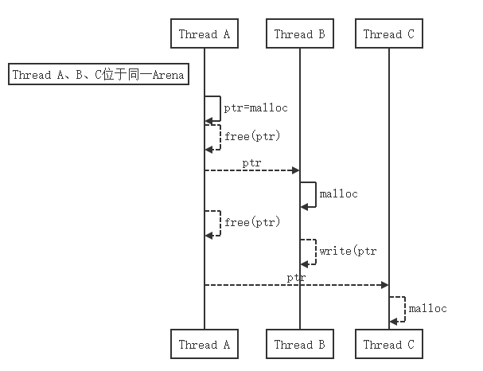
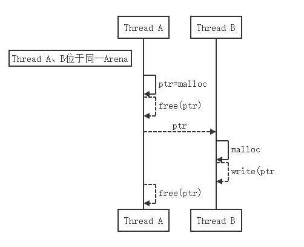
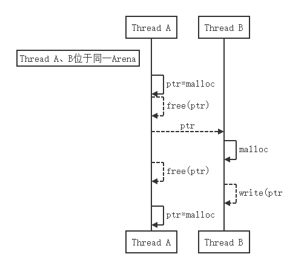
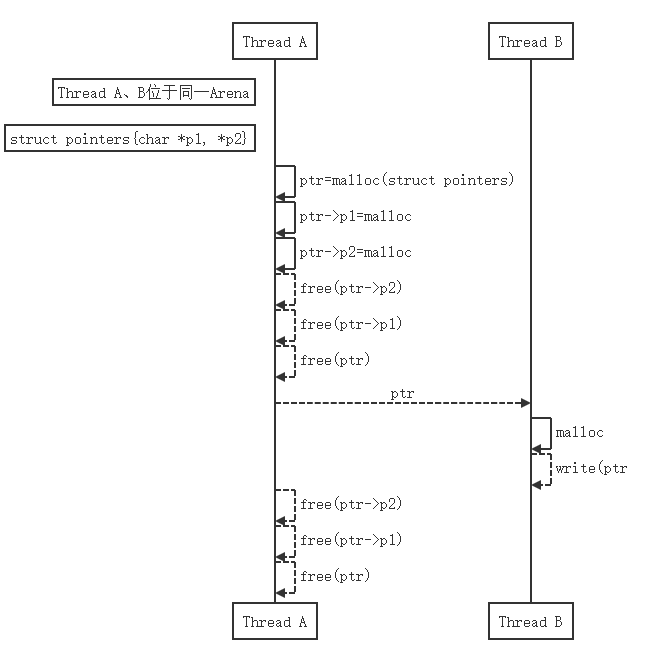

# Comfused Double Free In Engineering

到这里，libc中的流程和名词都已经解释得差不多了，本节将向大家展示可能存在于工程上复杂的double free问题。有的朋友可能会说，double free之前不是已经说过了吗？复杂又会怎样呢？ 

实际上，针对之前分析的double free，未必会在真正运行的系统中恰好报出这个`assert`，可能是会以别的`assert`乃至于段错误的形式存在，接下来将对可能的情形进行分析（和之前不同的是，本节将不采用源码来模拟，而是流程分析）：

- 非double free的线程出现`malloc`的SIGSEGV

  

  如上图所示，其实从上帝视角看，问题只有线程A出现double free，结果却会在别的线程上出现`malloc`崩溃。

  >假设线程A、线程B和线程C在同一个Arena，那么任何一个线程调用`free`所释放的chunk，都可能被其他线程通过`malloc`获取到，而此时就可能出现上图的情况，由于线程B以为自己拿到的指针还没被`free`，继续往里面写数据，殊不知已经写坏了缓存在libc内存池中的chunk的`fd`和`bk`指针，当线程C也调用`malloc`时，就很容易出现类似第三节所展示的SIGSEGV（崩溃在`malloc`内部对`bk`的访问）。

- 非double free的线程出现`free`的SIGSEGV

  

  如上图所示，和上一个问题一样，问题只有线程A出现double free，结果却会在别的线程上出现`free`崩溃。

  >假设线程A和线程B在同一个Arena，这次假设先是线程B正常写内存，而线程A再次`free`，此时也会因`free`内部需要合并前/后空闲的chunk而访问内部指针，从而极易出现非法地址的使用。

- double free的线程出现corrupted double-linked list

  

  如上图所示，之前的问题一样，问题只有线程A出现double free，结果这次是出现在了`malloc`的`unlink_chunk`上。

  >假设线程A和线程B在同一个Arena，这次假设是在线程B调用`write`之前就被线程A调用`free`释放了chunk，且在线程B调用`write`后继续`malloc`，此时，`malloc`内部可能会走到`unlink_chunk`的逻辑，将进行对chunk内部`fd`和`bk`的指针校验，从而出现corrupted double-linked list。

- double free的线程出现`free()`: invalid pointer

  

  如上图所示，这种情况和之前略有不同，首先假设有如上的`struct pointers`数据结构（结构体是`malloc`出来的，结构体中还有成员也是`malloc`出来的），这种情况下的`free`一般都是封装的函数，保证先`free`内部指针再`free`结构体指针。该情况下，其实往细了分析，若double free会有很多问题，在此先分析invalid pointer这个问题可能发生的原因。

  >假设线程A和线程B在同一个Arena，当线程A调用`free`将`ptr`中的成员和`ptr`自身释放时，若结构体指针被线程B拿到，往里面写了内容，此时在下一次`free`内部指针时（`free(ptr->p2)`调用处），会因libc对指针的对齐等校验失败而报出invalid pointer。
  
  
  虽然看着好像条件很苛刻，但实际上，结构体指针嵌套内部指针的情况，在开源软件和复杂软件中为了较好的封装性，使用比比皆是。

---

## 多啰嗦的话

到此，libc的内存管理就讲完了，最后之所以增加本节内容（本节的情景可能只能列出部分），主要是为了提醒大家关注，前面的几个小节虽然通过例子展示了libc管理的方式和越界可能导致的libc内存问题，但是即使知识掌握了，在复杂的软件工程上`assert`/SIGSEGV也只能当作提示而可能非根因。

