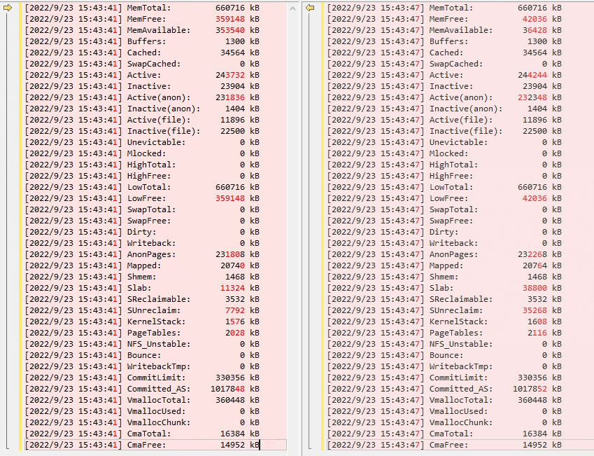
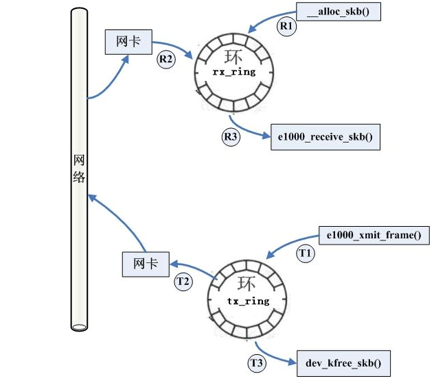
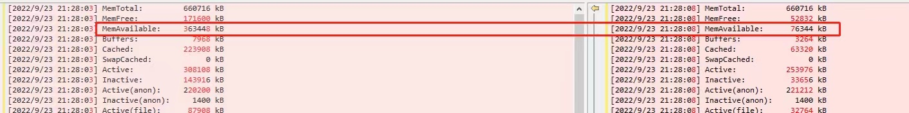
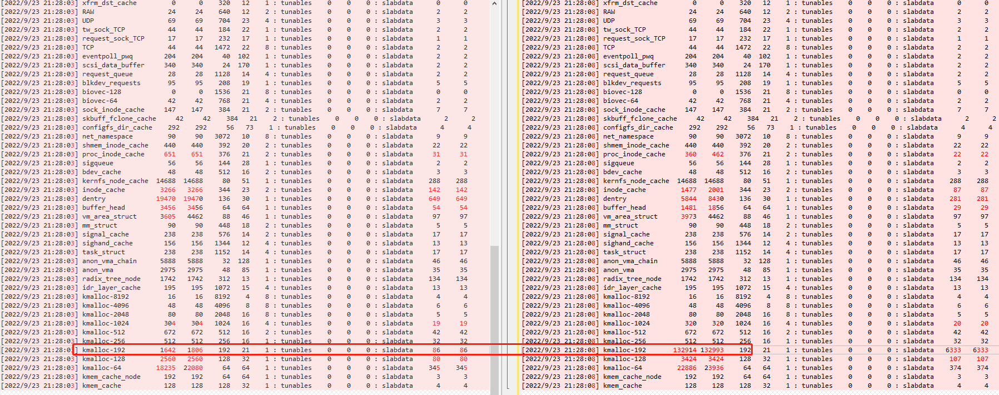

# Too Much Skb

## Content

- [简介](#简介)

- [`skb` 介绍](#skb介绍)

- [问题排查方法](#问题排查方法)
- [彩蛋-`ss` 工具编译方法](#补充知识点-ss工具编译方法) :heart_eyes:

---

## 简介

在嵌入式领域，有一种OOM问题非常棘手，当它出现时，内存急剧下降，即使捕捉到 `meminfo` 的也于事无补，如下图所示：



从Beyond Compare对比的情况可以看到：

1. 只用了6秒的时间（有时候更快），可用的内存从 *353540 kB* 降到了 *36428 kB*，足足降了300多MB
2. 明显有所增加的，除了内核的 `Slab` 信息外，没有其他任何信息的增加，而且 `Slab` 的增加量也才20多M 

当出现OOM时，OOM的提示信息也不能给你任何帮助：

```shell
[ 1774.982511] Mem-Info:
[ 1774.982531] active_anon:67813 inactive_anon:350 isolated_anon:0
[ 1774.982531]  active_file:19 inactive_file:0 isolated_file:0
[ 1774.982531]  unevictable:0 dirty:0 writeback:0 unstable:0
[ 1774.982531]  slab_reclaimable:838 slab_unreclaimable:9617
[ 1774.982531]  mapped:24 shmem:366 pagetables:530 bounce:0
[ 1774.982531]  free:1532 free_pcp:33 free_cma:0
[ 1774.982546] Node 0 active_anon:271252kB inactive_anon:1400kB active_file:76kB inactive_file:0kB unevictable:0kB isolated(anon):0kB isolated(file):0kB mapped:96kB dirty:0kB writeback:0kB shmem:1464kB writeback_tmp:0kB unstable:0kB pages_scanned:0 all_unreclaimable? no
[ 1774.982564] Normal free:6128kB min:16384kB low:20480kB high:24576kB active_anon:271252kB inactive_anon:1400kB active_file:76kB inactive_file:0kB unevictable:0kB writepending:0kB present:675840kB managed:660712kB mlocked:0kB slab_reclaimable:3352kB slab_unreclaimable:38468kB kernel_stack:1600kB pagetables:2120kB bounce:0kB free_pcp:132kB local_pcp:12kB free_cma:0kB
lowmem_reserve[]: 0 0 0
[ 1774.982599] Normal: 940*4kB (MC) 215*8kB (UM) 36*16kB (UM) 3*32kB (U) 0*64kB 0*128kB 0*256kB 0*512kB 0*1024kB 0*2048kB 0*4096kB = 6152kB
407 total pagecache pages
[ 1774.982605] 0 pages in swap cache
[ 1774.982609] Swap cache stats: add 0, delete 0, find 0/0
[ 1774.982611] Free swap  = 0kB
[ 1774.982612] Total swap = 0kB
[ 1774.982615] 168960 pages RAM
[ 1774.982617] 0 pages HighMem/MovableOnly
[ 1774.982618] 3782 pages reserved
[ 1774.982620] 4096 pages cma reserved
```

会发现，总有300多M无法找到耗在哪了。

但有一点一般会有迹可循的是，往往在这种情况下，OOM的打印中会存在网络申请内存的调用栈出现：

```shell
[ 1775.443722] Hardware name: Generic DT based system
[ 1775.448529] [<c010fc00>] (unwind_backtrace) from [<c010b778>] (show_stack+0x10/0x14)
[ 1775.456271] [<c010b778>] (show_stack) from [<c033edb8>] (dump_stack+0x88/0x9c)
[ 1775.463490] [<c033edb8>] (dump_stack) from [<c019693c>] (warn_alloc+0xf0/0x104)
[ 1775.470795] [<c019693c>] (warn_alloc) from [<c0196f94>] (__alloc_pages_nodemask+0x5b0/0xbb8)
[ 1775.479227] [<c0196f94>] (__alloc_pages_nodemask) from [<c0197734>] (__alloc_page_frag+0x134/0x14c)
[ 1775.488270] [<c0197734>] (__alloc_page_frag) from [<c04c6600>] (__netdev_alloc_skb+0x68/0x100)
[ 1775.496882] [<c04c6600>] (__netdev_alloc_skb) from [<c03e2c44>] (hisi_femac_rx_refill+0x7c/0x1f0)
[ 1775.505753] [<c03e2c44>] (hisi_femac_rx_refill) from [<c03e3178>] (hisi_femac_pre_receive+0x194/0x200)
[ 1775.515055] [<c03e3178>] (hisi_femac_pre_receive) from [<c03e45c4>] (hisi_femac_poll+0x50/0x358)
[ 1775.523837] [<c03e45c4>] (hisi_femac_poll) from [<c04d3aec>] (net_rx_action+0x108/0x2dc)
[ 1775.531925] [<c04d3aec>] (net_rx_action) from [<c011d378>] (__do_softirq+0xe0/0x23c)
[ 1775.539663] [<c011d378>] (__do_softirq) from [<c011d50c>] (run_ksoftirqd+0x38/0x50)
[ 1775.547318] [<c011d50c>] (run_ksoftirqd) from [<c0138140>] (smpboot_thread_fn+0x110/0x1a8)
[ 1775.555578] [<c0138140>] (smpboot_thread_fn) from [<c0134850>] (kthread+0xec/0xf4)
[ 1775.563144] [<c0134850>] (kthread) from [<c01077b8>] (ret_from_fork+0x14/0x3c)
```

> 不要误会，这个调用栈并不是问题的关键，它只是一个正常网络申请内存的调用栈而已。

这里的 `__netdev_alloc_skb` 中的 `skb` 便是这次的主角。

---

## skb介绍

`skb` 是Linux内核中表示接收/发送数据包的数据结构 `struct sk_buff` 的简称，这个结构被网络的不同层使用，并且其中的成员变量在结构从一层向另一层传递时改变。从网卡驱动层（e1000e驱动为例）可以很形象地看到 `skb` 的分配和释放，以及其担的大任。



各部分描述如下：

- R1：内核分配 `skb` ，并将其加入 `rx` 环形缓冲池，用于接收数据包
- R2：网卡接收网络数据，并将数据写入R1中分配的 `skb`
- R3：内核接收R2中的 `skb` ，此时R2中的 `skb` 已经脱离了 `rx` 环形缓冲池，最后内核会支持R1的操作以补充 `skb`
- T1：内核将要发送的 `skb` 写入 `tx` 环形缓冲池
- T2：网卡发送T1中写入的 `skb`
- T3：内核释放已经发送的 `skb`

> 值得注意的是，`skb` 分为两部分，一个是存储 `skb` 信息的结构，即`struct sk_buff`，一个是真正存放数据的部分，即 `struct sk_buff` 中的 `data` 成员指向的内存。

其它网络层使用 `skb` 的方法将不再展开，与本次的主题关系不大。

---

## 问题排查方法

既然 `meminfo` 和OOM信息都展现不出来丢失的内存，那是不是就无解了呢？

针对这种问题，个人总结，可以用两种方法排查是否真的就是 `skb` 耗掉了内存：

1. `slabinfo` 的查看：

   ```shell
   # cat /proc/slabinfo
   slabinfo - version: 2.1
   # name            <active_objs> <num_objs> <objsize> <objperslab> <pagesperslab> : tunables <limit> <batchcount> <sharedfactor> : slabdata <active_slabs> <num_slabs> <sharedavail>
   nf_conntrack        2809   2907    320   51    4 : tunables    0    0    0 : slabdata     57     57      0
   ovl_inode           8096   8096    736   44    8 : tunables    0    0    0 : slabdata    184    184      0
   fat_inode_cache      862    902    792   41    8 : tunables    0    0    0 : slabdata     22     22      0
   fat_cache              0      0     40  102    1 : tunables    0    0    0 : slabdata      0      0      0
   ext4_groupinfo_4k    140    140    144   28    1 : tunables    0    0    0 : slabdata      5      5      0
   ext4_inode_cache     407    459   1176   27    8 : tunables    0    0    0 : slabdata     17     17      0
   ...
   skbuff_head_cache  63520  63872    256   32    2 : tunables    0    0    0 : slabdata   1996   1996      0
   file_lock_cache     2072   2072    216   37    2 : tunables    0    0    0 : slabdata     56     56      0
   net_namespace        120    120   6784    4    8 : tunables    0    0    0 : slabdata     30     30      0
   shmem_inode_cache  12792  16641    760   43    8 : tunables    0    0    0 : slabdata    387    387      0
   ...
   kmalloc-192        90197  90510    192   42    2 : tunables    0    0    0 : slabdata   2155   2155      0
   kmalloc-128        39152  41088    128   32    1 : tunables    0    0    0 : slabdata   1284   1284      0
   kmalloc-96        108987 134862     96   42    1 : tunables    0    0    0 : slabdata   3211   3211      0
   kmalloc-64        483846 486528     64   64    1 : tunables    0    0    0 : slabdata   7602   7602      0
   kmalloc-32        499048 500224     32  128    1 : tunables    0    0    0 : slabdata   3908   3908      0
   kmalloc-16        2096060 2097664     16  256    1 : tunables    0    0    0 : slabdata   8194   8194      0
   kmalloc-8          92160  92160      8  512    1 : tunables    0    0    0 : slabdata    180    180      0
   kmem_cache_node    12608  12608     64   64    1 : tunables    0    0    0 : slabdata    197    197      0
   kmem_cache          8950   9184    512   32    4 : tunables    0    0    0 : slabdata    287    287      0
   ```

   这里的 `skbuff_head_cache` 就是前面提到的内核存储 `skb` 信息的结构（不是真正存放网卡数据的部分），但是如果该部分的内存突增，可以反应出此时网卡的数据阻塞非常严重（这也解释了为什么出现问题时，内核的 `Slab` 对应的内存突增了）。

   但是有时候，调用 `cat /proc/slabinfo` 会出现看不到 `skbuff_head_cache` 的情况，甚至有的平台在 `/proc`  下都没有 `slabinfo` 这个节点，这时候应该怎么办呢？这种情况下，其实往往是因为启用了 `Slub` 导致的，它会将一样大小即使不同功能 *cache* 的 `Slab` 合并统计，这在 `/sys/kernel/slab` 中可以看出：

   ```shell
   /sys/kernel/slab # ls -l
   total 0
   drwxr-xr-x    2 root     root             0 Jan  1 10:39 :at-0000016
   drwxr-xr-x    2 root     root             0 Jan  1 10:39 :at-0000032
   drwxr-xr-x    2 root     root             0 Jan  1 10:39 :at-0000040
   drwxr-xr-x    2 root     root             0 Jan  1 10:39 :at-0000048
   drwxr-xr-x    2 root     root             0 Jan  1 10:39 :at-0000064
   drwxr-xr-x    2 root     root             0 Jan  1 10:39 :at-0000080
   drwxr-xr-x    2 root     root             0 Jan  1 10:39 :at-0000104
   drwxr-xr-x    2 root     root             0 Sep 26  2022 :at-0000120
   drwxr-xr-x    2 root     root             0 Sep 26  2022 :at-0000128
   drwxr-xr-x    2 root     root             0 Jan  1 10:39 :at-0000152
   drwxr-xr-x    2 root     root             0 Jan  1 10:39 :at-0000192
   drwxr-xr-x    2 root     root             0 Jan  1 10:39 :at-0000224
   drwxr-xr-x    2 root     root             0 Jan  1 10:39 :t-0000016
   drwxr-xr-x    2 root     root             0 Jan  1 10:39 :t-0000024
   drwxr-xr-x    2 root     root             0 Jan  1 10:39 :t-0000032
   drwxr-xr-x    2 root     root             0 Jan  1 10:39 :t-0000040
   drwxr-xr-x    2 root     root             0 Jan  1 10:39 :t-0000056
   drwxr-xr-x    2 root     root             0 Jan  1 10:39 :t-0000064
   drwxr-xr-x    2 root     root             0 Jan  1 10:39 :t-0000072
   drwxr-xr-x    2 root     root             0 Jan  1 10:39 :t-0000080
   drwxr-xr-x    2 root     root             0 Jan  1 10:39 :t-0000088
   drwxr-xr-x    2 root     root             0 Jan  1 10:39 :t-0000104
   drwxr-xr-x    2 root     root             0 Jan  1 10:39 :t-0000128
   drwxr-xr-x    2 root     root             0 Jan  1 10:39 :t-0000136
   drwxr-xr-x    2 root     root             0 Jan  1 10:39 :t-0000144
   drwxr-xr-x    2 root     root             0 Jan  1 10:39 :t-0000152
   drwxr-xr-x    2 root     root             0 Jan  1 10:39 :t-0000168
   drwxr-xr-x    2 root     root             0 Jan  1 10:39 :t-0000192
   ...
   lrwxrwxrwx    1 root     root             0 Jan  1 10:39 kmalloc-1024 -> :t-0001024
   lrwxrwxrwx    1 root     root             0 Jan  1 10:39 kmalloc-128 -> :t-0000128
   lrwxrwxrwx    1 root     root             0 Jan  1 10:39 kmalloc-192 -> :t-0000192
   ...
   lrwxrwxrwx    1 root     root             0 Jan  1 10:39 skbuff_fclone_cache -> :t-0000384
   lrwxrwxrwx    1 root     root             0 Jan  1 10:39 skbuff_head_cache -> :t-0000192
   ...
   ```

   可以看到，这种情况下，`skbuff_head_cache` 和 `kmalloc-192` 统计到了一起，都属于 192 字节大小的缓存，因此：

   - 对于有 `/proc/slabinfo` 节点的设备，`cat /proc/slabinfo` 中 `kmalloc-192` 的部分就反映了 `skbuff_head_cache` 的变化（当然有时也会包含别的功能，这里主要是提示大家关注 `kmalloc-192`）
   - 对于没有 `/proc/slabinfo` 节点的设备，可以直接查看 `/sys/kernel/slab/skbuff_head_cache/objects` 来得到有多少个192字节缓存对象（包含 `skb` 的部分）

   所以，这种情况下，定时查看 `meminfo` 和 `slabinfo` 是可以看出端倪的：

   

   

2. *iproute2* 中的 `ss` 工具：

   *iproute2* 是Linux下管理控制TCP/IP网络和流量控制的新一代工具包，其中 `ss` 工具堪称比 `netstat` 更加有效更加强大。这里主要列举其查看 `skb` 的方式：

   ```shell
   [2022/9/23 15:43:47] # ss -amp
   [2022/9/23 15:43:47] Netid State  Recv-Q Send-Q                      Local Address:Port                  Peer Address:Port   
   [2022/9/23 15:43:47] nl    UNCONN 0      0                                    rtnl:2484                              *        skmem:(r0,rb163840,t0,tb163840,f0,w0,o0,bl0,d0)                                           
   [2022/9/23 15:43:47] nl    UNCONN 0      0                                    rtnl:kernel                            *        skmem:(r0,rb163840,t0,tb163840,f0,w0,o0,bl0,d0)                                           
   [2022/9/23 15:43:47] nl    UNCONN 0      0                                    rtnl:4195264                           *        skmem:(r0,rb131070,t0,tb65536,f0,w0,o0,bl0,d0)                                            
   [2022/9/23 15:43:47] nl    UNCONN 0      0                                    rtnl:netifd/960                        *        skmem:(r0,rb65536,t0,tb65536,f0,w0,o0,bl0,d0)                                             
   [2022/9/23 15:43:47] nl    UNCONN 0      0                                    rtnl:dnsmasq/2549                      *        skmem:(r0,rb163840,t0,tb163840,f0,w0,o0,bl0,d0)                                           
   [2022/9/23 15:43:47] nl    UNCONN 0      0                                    rtnl:dnsmasq/2549                      *        skmem:(r0,rb163840,t0,tb163840,f0,w0,o0,bl0,d0)                                           
   [2022/9/23 15:43:47] nl    UNCONN 0      0                                    rtnl:2484                              *        skmem:(r0,rb163840,t0,tb163840,f0,w0,o0,bl0,d0)                                           
   [2022/9/23 15:43:47] nl    UNCONN 0      0                                    rtnl:4195264                           *        skmem:(r0,rb131070,t0,tb65536,f0,w0,o0,bl0,d0)                                            
   [2022/9/23 15:43:47] nl    UNCONN 4288   0                                 tcpdiag:ss/
   ...
   [2022/9/23 15:43:47] udp   UNCONN 1277   0                                  0.0.0.0:53764                     0.0.0.0:*      users:(("ntpd",pid=1755,fd=3))                                                         
   [2022/9/23 15:43:47] udp   UNCONN 0      0                               127.0.0.1:domain                     0.0.0.0:*      users:(("dnsmasq",pid=2549,fd=6))                                                          
   [2022/9/23 15:43:47] udp   UNCONN 0      0                             172.30.1.28:domain                     0.0.0.0:*      users:(("dnsmasq",pid=2549,fd=4))                                                          
   [2022/9/23 15:43:47] udp   UNCONN 0      0             [fe80::2267:e0ff:feb2:d7f4]:domain                           *:*      users:(("dnsmasq",pid=2549,fd=22))                                                         
   [2022/9/23 15:43:47] udp   UNCONN 0      0                                   [::1]:domain                           *:*      users:(("dnsmasq",pid=2549,fd=12))                                                         
   [2022/9/23 15:43:47] udp   UNCONN 0      0                     [fd21:f5a5:89f6::1]:domain                           *:*      users:(("dnsmasq",pid=2549,fd=10))                                                         
   [2022/9/23 15:43:47] udp   UNCONN 0      32                          10.204.192.37:domain                     0.0.0.0:*      users:(("dnsmasq",pid=2549,fd=25))                                                          
   ...
   [2022/9/23 15:43:47] tcp   ESTAB  0      0                             172.30.1.28:ssh                    172.30.1.38:50337  users:(("dropbear",pid=5608,fd=5))
   [2022/9/23 15:43:47]   skmem:(r0,rb330880,t0,tb49280,f4096,w0,o0,bl0,d1)     
   [2022/9/23 15:43:47] tcp   ESTAB  0      33056                         172.30.1.28:ssh                    172.30.1.38:50330  users:(("dropbear",pid=4514,fd=5))
   [2022/9/23 15:43:47]   skmem:(r0,rb330880,t0,tb89600,f2272,w38688,o0,bl0,d0) 
   [2022/9/23 15:43:47] tcp   ESTAB  0      0                             172.30.1.28:ssh                    172.30.1.38:50331  users:(("dropbear",pid=4517,fd=5))
   [2022/9/23 15:43:47]   skmem:(r0,rb330880,t0,tb44800,f0,w0,o0,bl0,d0)        
   [2022/9/23 15:43:47] tcp   LISTEN 0      32      [fe80::2267:e0ff:feb2:d7f4]%wlan0:domain                        [::]:*      users:(("dnsmasq",pid=2549,fd=23))
   [2022/9/23 15:43:47]   skmem:(r0,rb87380,t0,tb16384,f0,w0,o0,bl0,d0)   
   ```

   这里可以看到，出现异常时，*Recv-Q* / *Send-Q* 会阻塞很多，而导致大量的 `skb` 内存占用，这可能由于某个应用取网络数据包不及时导致，也可能由于网络数据包太多导致，也可能是网络ARP包/其他协议数据包太多导致网络卡顿而产生网络数据积压。

---

## 补充知识点-ss工具编译方法

ss工具的编译其实不是每个交叉编译链都那么顺利的，这里简单总结给各位：

1. 下载 [*iproute2* 源码](https://mirrors.edge.kernel.org/pub/linux/utils/net/iproute2/) 

2. 配置交叉工具链：

   ```diff
   # cd iproute2-5.3.0
   # vim Makefile
   -CC := gcc
   +CC := arm-himix200-linux-gcc
   -SUBDIRS=lib ip tc bridge misc netem genl tipc devlink rdma man
   +SUBDIRS=lib misc
   # make
   ```

   此时不顺利的话会报一些 *libelf* 的错误 

3. 修改默认的 `config.mk`：

   ```diff
   # vim config.mk
   -AR:=ar
   +AR:=arm-himix200-linux-ar
   -IP_CONFIG_SETNS:=y
   -CFLAGS += -DHAVE_SETNS
   -HAVE_SELINUX:=y
   -LDLIBS += -lselinux
   -CFLAGS += -DHAVE_SELINUX
   -HAVE_ELF:=y
   -CFLAGS += -DHAVE_ELF
   -LDLIBS +=  -lelf
   +#IP_CONFIG_SETNS:=y
   +#CFLAGS += -DHAVE_SETNS
   +#HAVE_SELINUX:=y
   +#LDLIBS += -lselinux
   +#CFLAGS += -DHAVE_SELINUX
   +#HAVE_ELF:=y
   +#CFLAGS += -DHAVE_ELF
   +#LDLIBS +=  -lelf
   # make
   ```

4. 此时还是可能会出现如下错误：

   ```shell
   lib
       CC       bpf.o
       CC       exec.o
   In file included from exec.c:8:0:
   ../include/namespace.h:41:19: error: static declaration of ‘setns’ follows non-static declaration
    static inline int setns(int fd, int nstype)
   ```

   再尝试去掉 *namespace* 的部分：

   ```diff
   # vim lib/Makefile
   -UTILOBJ = utils.o rt_names.o ll_map.o ll_types.o ll_proto.o ll_addr.o \
   -        inet_proto.o namespace.o json_writer.o json_print.o \
   -        names.o color.o bpf.o exec.o fs.o
   +UTILOBJ = utils.o rt_names.o ll_map.o ll_types.o ll_proto.o ll_addr.o \
   +        inet_proto.o json_writer.o json_print.o \
   +        names.o color.o fs.o
   ```

5. 此时可能还会出现：

   ```shell
   lib
       CC       fs.o
       CC       mpls_ntop.o
       CC       mpls_pton.o
       AR       libutil.a
   
   misc
       CC       ss.o
   In file included from ss.c:36:0:
   ../include/namespace.h:41:19: error: static declaration of ‘setns’ follows non-static declaration
    static inline int setns(int fd, int nstype)
   ```

   再尝试去掉 `ss` 中的 *namespace* 部分：

   ```diff
   # vim misc/ss.c
   -#include "namespace.h"
   +//#include "namespace.h"
                   case 'N':
   -                        if (netns_switch(optarg))
   -                                exit(1);
   +                        //if (netns_switch(optarg))
   +                                //exit(1);
   # make
   lib
   make[1]: Nothing to be done for 'all'.
   
   misc
       CC       ss.o
   In file included from ../include/uapi/linux/tipc.h:42:0,
                    from ss.c:51:
   ../include/uapi/linux/sockios.h:45:0: warning: "SIOCGSTAMP" redefined
    #define SIOCGSTAMP ((sizeof(struct timeval))  == 8 ? \
   
   In file included from /home/opt/hisi-linux/x86-arm/arm-himix200-linux/target/usr/include/asm/socket.h:4:0,
                    from /home/opt/hisi-linux/x86-arm/arm-himix200-linux/target/usr/include/bits/socket.h:370,
                    from /home/opt/hisi-linux/x86-arm/arm-himix200-linux/target/usr/include/sys/socket.h:38,
                    from ss.c:17:
   /home/opt/hisi-linux/x86-arm/arm-himix200-linux/target/usr/include/asm/sockios.h:10:0: note: this is the location of the previous definition
    #define SIOCGSTAMP 0x8906  /* Get stamp (timeval) */
   
   In file included from ../include/uapi/linux/tipc.h:42:0,
                    from ss.c:51:
   ../include/uapi/linux/sockios.h:47:0: warning: "SIOCGSTAMPNS" redefined
    #define SIOCGSTAMPNS ((sizeof(struct timespec)) == 8 ? \
   
   In file included from /home/opt/hisi-linux/x86-arm/arm-himix200-linux/target/usr/include/asm/socket.h:4:0,
                    from /home/opt/hisi-linux/x86-arm/arm-himix200-linux/target/usr/include/bits/socket.h:370,
                    from /home/opt/hisi-linux/x86-arm/arm-himix200-linux/target/usr/include/sys/socket.h:38,
                    from ss.c:17:
   /home/opt/hisi-linux/x86-arm/arm-himix200-linux/target/usr/include/asm/sockios.h:11:0: note: this is the location of the previous definition
    #define SIOCGSTAMPNS 0x8907  /* Get stamp (timespec) */
   
       LINK     ss
       CC       nstat
       CC       ifstat
       CC       rtacct
       CC       lnstat.o
       CC       lnstat_util.o
       LINK     lnstat
   ```

   大功告成！


