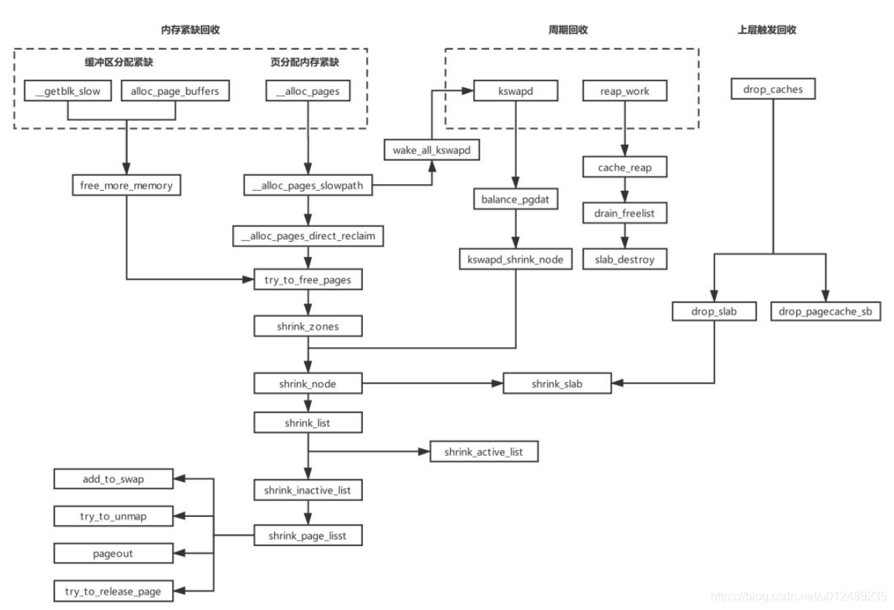

# 令人费解的 *iowait* 高问题

## Content

- [简介](#简介)
- [小工具走起](#获取数据)
- [疑无路](#数据分析)
- [又一村](#细节决定成败)
- [总结](#总结)
- [内存回收机制](#内存回收机制)

## 简介

在漫漫的工程师生涯中，只要是工作经验丰富的朋友，相信都会碰到 *CPU* 占用过高的问题，但是这里将 *CPU* 过高问题放到内存章节里面讲，是不是有点牛头不对马嘴了？其实不然，请耐心看完这个故事。

## 获取数据

故事的开头是，测试发现软件功能不正常，服务也显示离线了，此时研发查看进程情况，使用 `top` 命令：

```shell
Mem: 621420K used, 40336K free, 1448K shrd, 116K buff, 5136K cached
CPU:   1% usr  15% sys   0% nic   0% idle  83% io   0% irq   0% sirq
Load average: 12.65 11.29 10.04 4/180 16057
  PID  PPID USER     STAT   VSZ %VSZ %CPU COMMAND
   31     2 root     SW       0   0%   5% [kswapd0]
 2469     1 root     D     941m 145%   4% /usr/bin/app
   67     2 root     DW       0   0%   4% [mmcqd/0]
 1263     1 root     S    64952  10%   1% device_service
 1290     1 root     S     203m  31%   1% media_service
 8105 14024 root     R     3244   0%   1% top -d 1
...
  493     1 root     S     292m  45%   0% /sbin/logd -S 64
...
  230     1 root     S    18644   3%   0% /sbin/ubusd
...
    5     2 root     SW<      0   0%   0% [kworker/0:0H]
    8     2 root     SW       0   0%   0% [rcu_bh]
```

发现进程还活着，占用CPU也很少，但是 *idle* 很低。细看发现，*iowait* 占用很高，因而定性为 *iowait* 导致的网络和进程卡死问题。

既然确定是 *io* 问题了，就把 [*sysstat*](http://sebastien.godard.pagesperso-orange.fr/download.html) 的工具编一编

```shell
$ ./configure --host=arm CC=arm-himix200-linux-gcc
.
Check programs:
.
checking for arm-gcc... arm-himix200-linux-gcc
checking whether the C compiler works... yes
...
$ make
arm-himix200-linux-gcc -o sadc.o -c -g -O2 -Wall -Wstrict-prototypes -pipe -O2  -DSA_DIR=\"/var/log/sa\" -DSADC_PATH=\"/usr/local/lib64/sa/sadc\"    -DHAVE_SYS_SYSMACROS_H -DHAVE_LINUX_SCHED_H -DHAVE_SYS_PARAM_H -DUSE_NLS -DPACKAGE=\"sysstat\" -DLOCALEDIR=\"/usr/local/share/locale\" sadc.c
...
```

拷贝到 *NFS* 挂载目录，用 `iostat` 看看数据吧：

```shell
root@OpenWrt:~# /mnt/nfs/mpstat -P ALL 1
Linux 4.9.37 (OpenWrt)  03/15/22        _armv7l_        (2 CPU)

17:04:18     CPU    %usr   %nice    %sys %iowait    %irq   %soft  %steal  %guest  %gnice   %idle
17:04:19     all    0.72    0.00   17.99   81.29    0.00    0.00    0.00    0.00    0.00    0.00
17:04:19       0    0.00    0.00   20.14   79.86    0.00    0.00    0.00    0.00    0.00    0.00
17:04:19       1    1.44    0.00   15.83   82.73    0.00    0.00    0.00    0.00    0.00    0.00

17:04:19     CPU    %usr   %nice    %sys %iowait    %irq   %soft  %steal  %guest  %gnice   %idle
17:04:20     all    0.71    0.00   18.57   80.71    0.00    0.00    0.00    0.00    0.00    0.00
17:04:20       0    0.00    0.00   15.71   84.29    0.00    0.00    0.00    0.00    0.00    0.00
17:04:20       1    1.43    0.00   21.43   77.14    0.00    0.00    0.00    0.00    0.00    0.00

17:04:20     CPU    %usr   %nice    %sys %iowait    %irq   %soft  %steal  %guest  %gnice   %idle
17:04:21     all    2.29    0.00   18.81   78.44    0.00    0.46    0.00    0.00    0.00    0.00
17:04:21       0    2.75    0.00   18.35   77.98    0.00    0.92    0.00    0.00    0.00    0.00
17:04:21       1    1.83    0.00   19.27   78.90    0.00    0.00    0.00    0.00    0.00    0.00
root@OpenWrt:~# /mnt/nfs/iostat -d -x -k 1 10
Linux 4.9.37 (OpenWrt)  03/15/22        _armv7l_        (2 CPU)

Device            r/s     rkB/s   rrqm/s  %rrqm r_await rareq-sz     w/s     wkB/s   wrqm/s  %wrqm w_await wareq-sz     d/s     dkB/s   drqm/s  %drqm d_await dareq-sz     f/s f_await  aqu-sz  %util
mmcblk0         51.26   1782.85     2.50   4.64   18.50    34.78    0.87     37.24     0.52  37.61    6.30    42.81    0.00      0.00     0.00   0.00    0.00     0.00    0.00    0.00    0.97   5.72


Device            r/s     rkB/s   rrqm/s  %rrqm r_await rareq-sz     w/s     wkB/s   wrqm/s  %wrqm w_await wareq-sz     d/s     dkB/s   drqm/s  %drqm d_await dareq-sz     f/s f_await  aqu-sz  %util
mmcblk0       1205.88  46352.94    50.00   3.98   24.66    38.44    0.00      0.00     0.00   0.00    0.00     0.00    0.00      0.00     0.00   0.00    0.00     0.00    0.00    0.00   29.66 134.31


Device            r/s     rkB/s   rrqm/s  %rrqm r_await rareq-sz     w/s     wkB/s   wrqm/s  %wrqm w_await wareq-sz     d/s     dkB/s   drqm/s  %drqm d_await dareq-sz     f/s f_await  aqu-sz  %util
mmcblk0        338.32  18568.22   104.67  23.63   11.33    54.88    0.00      0.00     0.00   0.00    0.00     0.00    0.00      0.00     0.00   0.00    0.00     0.00    0.00    0.00    4.48  54.21

```

但是这些数据无法和进程关联起来，根本没法分析，于是转而使用 `pidstat` ：

```shell
root@OpenWrt:~# /mnt/nfs/pidstat -d 1
Linux 4.9.37 (OpenWrt)  03/15/22        _armv7l_        (2 CPU)

16:58:00      UID       PID   kB_rd/s   kB_wr/s kB_ccwr/s iodelay  Command

16:58:02      UID       PID   kB_rd/s   kB_wr/s kB_ccwr/s iodelay  Command

16:58:03      UID       PID   kB_rd/s   kB_wr/s kB_ccwr/s iodelay  Command

16:58:04      UID       PID   kB_rd/s   kB_wr/s kB_ccwr/s iodelay  Command
^C
root@OpenWrt:/data# ./pidstat -u 1
Linux 4.9.37 (OpenWrt) 03/17/22 _armv7l_(2 CPU)

16:28:00      UID       PID    %usr %system  %guest   %wait    %CPU   CPU  Command
16:28:02        0         3    0.00    0.61    0.00    0.00    0.61     0  ksoftirqd/0
16:28:02        0         7    0.00    0.61    0.00    0.00    0.61     1  rcu_sched
16:28:02        0        31    0.00   61.35    0.00    0.00   61.35     0  kswapd0
16:28:02        0        67    0.00    8.59    0.00    0.00    8.59     1  mmcqd/0
16:28:02        0       337    0.00    0.61    0.00    0.00    0.61     0  irq/48-VI_CAP0
16:28:02        0       352    0.00    0.61    0.00    0.00    0.61     0  hi_vdec_thread
16:28:02        0       493    0.00    0.61    0.00    0.00    0.61     1  logd
16:28:02        0      1191    0.00    0.61    0.00    0.00    0.61     0  hifb_service
16:28:02        0      1263    0.00    3.68    0.00    0.00    3.68     1  device_service
16:28:02        0      1290    0.00    1.23    0.00    0.00    1.23     1  media_service
16:28:02        0      1354    0.00    1.84    0.00    0.00    1.84     0  fota_service
16:28:02        0      2469    0.00    9.20    0.00    0.00    9.20     0  app
16:28:02        0     18359    0.61    0.00    0.00    0.00    0.61     0  dropbear
16:28:02        0     21576    0.00    0.61    0.00    0.00    0.61     0  grep
16:28:02        0     21579    0.61    1.84    0.00    0.00    2.45     1  pidstat

16:28:02      UID       PID    %usr %system  %guest   %wait    %CPU   CPU  Command
16:28:05        0         7    0.00    0.27    0.00    0.00    0.27     1  rcu_sched
16:28:05        0        26    0.00    0.27    0.00    0.00    0.27     0  kworker/0:1
16:28:05        0        31    0.00  298.38    0.00    0.00  298.38     0  kswapd0
16:28:05        0        67    0.00   21.08    0.00    0.00   21.08     1  mmcqd/0
16:28:05        0       271    0.00    0.27    0.00    0.00    0.27     1  urngd
16:28:05        0       337    0.00    1.62    0.00    0.00    1.62     0  irq/48-VI_CAP0
16:28:05        0       352    0.00    0.27    0.00    0.00    0.27     1  hi_vdec_thread
16:28:05        0       493    0.00    0.54    0.00    0.00    0.54     1  logd
16:28:05        0       883    0.00    0.27    0.00    0.00    0.27     1  netifd
16:28:05        0      1263    0.00    2.97    0.00    0.00    2.97     1  device_service
16:28:05        0      1290    0.54    4.32    0.00    0.00    4.86     1  media_service
16:28:05        0      1354    0.00    0.54    0.00    0.00    0.54     1  fota_service
16:28:05        0      2469    1.08   14.32    0.00    0.00   15.41     1  app
16:28:05        0     13998    0.27    0.27    0.00    0.00    0.54     1  dropbear
16:28:05        0     18359    0.00    0.27    0.00    0.00    0.27     1  dropbear
16:28:05        0     21575    0.54    0.00    0.00    0.00    0.54     1  ping
16:28:05        0     21576    0.00    0.27    0.00    0.00    0.27     1  grep
16:28:05        0     21577    0.00    0.81    0.00    0.00    0.81     0  wc
16:28:05        0     21579    0.00    2.97    0.00    0.00    2.97     1  pidstat
16:28:05        0     21581    0.00    1.08    0.00    0.00    1.08     1  sh
```

虽然 *app* 占用很低，但是仍然坚信一定是它引起的，于是查看了它所有打开的 *fd* 进行分析，是否存在大文件的读取，且对某些文件进行删除，看是否可以恢复：

```shell
root@OpenWrt:/data# ls -l /proc/2469/fd/
lr-x------    1 root     root            64 Mar 17 15:05 0 -> /dev/null
lrwx------    1 root     root            64 Mar 17 15:05 1 -> /dev/pts/0
lrwx------    1 root     root            64 Mar 17 15:06 10 -> anon_inode:[eventfd]
lrwx------    1 root     root            64 Mar 17 15:06 11 -> /dev/fb0
lrwx------    1 root     root            64 Mar 17 15:06 12 -> /dev/tty0
lrwx------    1 root     root            64 Mar 17 15:06 13 -> socket:[350833]
lrwx------    1 root     root            64 Mar 17 15:06 14 -> socket:[350834]
lr-x------    1 root     root            64 Mar 17 15:06 15 -> anon_inode:inotify
lr-x------    1 root     root            64 Mar 17 15:06 16 -> anon_inode:inotify
lr-x------    1 root     root            64 Mar 17 15:06 17 -> /dev/input/event1
...
lrwx------    1 root     root            64 Mar 17 15:06 27 -> /data/database/app.k (deleted)
lrwx------    1 root     root            64 Mar 17 15:06 28 -> /data/database/app.v (deleted)
...
```

## 数据分析

上面的信息汇总分析一下，发现问题没有更清晰，反而可以得到如下几个疑惑点：

1. `iostat` 只能看到 *mmcblk0* 一直在被读，大小和读取速度还不小，但是不知道是什么文件，而且从之前的 `top` 信息可以看到 *cache* 非常小
2. `pidstat` 的 `-d` 选项是看进程IO使用情况的，啥也没有，反而是 `-u` 选项发现一个内核的进程（`kswapd0`） *CPU* 很高
3. 分析 `app` 的文件句柄发现即使删除了怀疑的文件，也不能恢复，*iowait* 依然很高

## 细节决定成败

群策群力下，决定使用 *sysrq* 一探究竟：

```shell
root@OpenWrt:~# echo l > /proc/sysrq-trigger
root@OpenWrt:~# dmesg
[47807.752788] sysrq: SysRq : Show backtrace of all active CPUs
[47807.758527] NMI backtrace for cpu 1
[47807.762033] CPU: 1 PID: 14024 Comm: ash Tainted: P           O    4.9.37 #0
[47807.769034] Hardware name: Generic DT based system
[47807.773896] [<c010fc00>] (unwind_backtrace) from [<c010b778>] (show_stack+0x10/0x14)
[47807.781670] [<c010b778>] (show_stack) from [<c0335538>] (dump_stack+0x88/0x9c)
[47807.788924] [<c0335538>] (dump_stack) from [<c0338dbc>] (nmi_cpu_backtrace+0xc0/0xc4)
[47807.796781] [<c0338dbc>] (nmi_cpu_backtrace) from [<c0338ea0>] (nmi_trigger_cpumask_backtrace+0xe0/0x128)
[47807.806392] [<c0338ea0>] (nmi_trigger_cpumask_backtrace) from [<c0381498>] (__handle_sysrq+0xa4/0x170)
[47807.815757] [<c0381498>] (__handle_sysrq) from [<c03819f8>] (write_sysrq_trigger+0x54/0x64)
[47807.824146] [<c03819f8>] (write_sysrq_trigger) from [<c022b8c8>] (proc_reg_write+0x5c/0x84)
[47807.832522] [<c022b8c8>] (proc_reg_write) from [<c01d4e94>] (__vfs_write+0x1c/0x110)
[47807.840295] [<c01d4e94>] (__vfs_write) from [<c01d5c80>] (vfs_write+0xa4/0x168)
[47807.847641] [<c01d5c80>] (vfs_write) from [<c01d6a1c>] (SyS_write+0x3c/0x90)
[47807.854752] [<c01d6a1c>] (SyS_write) from [<c0107700>] (ret_fast_syscall+0x0/0x3c)
[47807.862508] Sending NMI from CPU 1 to CPUs 0:
[47807.867086] NMI backtrace for cpu 0
[47807.870574] CPU: 0 PID: 31 Comm: kswapd0 Tainted: P           O    4.9.37 #0
[47807.877612] Hardware name: Generic DT based system
[47807.882393] task: e79b8900 task.stack: e79e8000
[47807.886914] PC is at shrink_page_list+0x94/0xc18
[47807.891521] LR is at shrink_page_list+0x80/0xc18
[47807.896129] pc : [<c019e230>]    lr : [<c019e21c>]    psr: 600f0113
[47807.902385] sp : e79e9d38  ip : 00000000  fp : 00000000
[47807.907599] r10: e79e9d78  r9 : 00000001  r8 : c092af44
[47807.912814] r7 : e79e9e18  r6 : e79e9f18  r5 : e7f49d00  r4 : e7f49d14
[47807.919330] r3 : e81a7054  r2 : e79e9e18  r1 : 00000100  r0 : 00000200
[47807.925847] Flags: nZCv  IRQs on  FIQs on  Mode SVC_32  ISA ARM  Segment none
[47807.932971] Control: 10c5387d  Table: a5af406a  DAC: 00000051
[47807.938707] CPU: 0 PID: 31 Comm: kswapd0 Tainted: P           O    4.9.37 #0
[47807.945743] Hardware name: Generic DT based system
[47807.950525] [<c010fc00>] (unwind_backtrace) from [<c010b778>] (show_stack+0x10/0x14)
[47807.958256] [<c010b778>] (show_stack) from [<c0335538>] (dump_stack+0x88/0x9c)
[47807.965468] [<c0335538>] (dump_stack) from [<c0338d70>] (nmi_cpu_backtrace+0x74/0xc4)
[47807.973286] [<c0338d70>] (nmi_cpu_backtrace) from [<c010db54>] (handle_IPI+0xcc/0x1d8)
[47807.981192] [<c010db54>] (handle_IPI) from [<c010145c>] (gic_handle_irq+0x88/0x8c)
[47807.988750] [<c010145c>] (gic_handle_irq) from [<c010c34c>] (__irq_svc+0x6c/0x90)
[47807.996221] Exception stack(0xe79e9ce8 to 0xe79e9d30)
[47808.001263] 9ce0:                   00000200 00000100 e79e9e18 e81a7054 e7f49d14 e7f49d00
[47808.009429] 9d00: e79e9f18 e79e9e18 c092af44 00000001 e79e9d78 00000000 00000000 e79e9d38
[47808.017593] 9d20: c019e21c c019e230 600f0113 ffffffff
[47808.022635] [<c010c34c>] (__irq_svc) from [<c019e230>] (shrink_page_list+0x94/0xc18)
[47808.030366] [<c019e230>] (shrink_page_list) from [<c019f544>] (shrink_inactive_list+0x2e4/0x45c)
[47808.039140] [<c019f544>] (shrink_inactive_list) from [<c019fe1c>] (shrink_node+0x46c/0x89c)
[47808.047478] [<c019fe1c>] (shrink_node) from [<c01a0a50>] (kswapd+0x2a8/0x61c)
[47808.054602] [<c01a0a50>] (kswapd) from [<c0134844>] (kthread+0xec/0xf4)
[47808.061206] [<c0134844>] (kthread) from [<c01077b8>] (ret_from_fork+0x14/0x3c)
```

多次使用 `l` 来分析 *CPU* 执行的栈，发现 `kswapd0` 确实长期占着 *CPU* 而且一直在 `shrink_node` （释放内存），结合之前发现这个进程占用 *CPU* 很高，逐渐将分析 *iowait* 的方向转移到内存上来。

```shell
root@OpenWrt:~# echo w > /proc/sysrq-trigger
root@OpenWrt:~# dmesg
[49686.374707] sysrq: SysRq : Show Blocked State
[49686.379189]   task                PC stack   pid father
[49686.384454] logd            D    0   493      1 0x00000000
[49686.389994] [<c05ef3e4>] (__schedule) from [<c05ef724>] (schedule+0x40/0xa0)
[49686.397072] [<c05ef724>] (schedule) from [<c05f22a8>] (schedule_timeout+0x134/0x174)
[49686.404823] [<c05f22a8>] (schedule_timeout) from [<c05ef21c>] (io_schedule_timeout+0x7c/0xb4)
[49686.413391] [<c05ef21c>] (io_schedule_timeout) from [<c05eff18>] (bit_wait_io+0x10/0x5c)
[49686.421515] [<c05eff18>] (bit_wait_io) from [<c05efb94>] (__wait_on_bit+0x60/0xb8)
[49686.429108] [<c05efb94>] (__wait_on_bit) from [<c018e468>] (wait_on_page_bit_killable+0x88/0x98)
[49686.437934] [<c018e468>] (wait_on_page_bit_killable) from [<c018eea0>] (__lock_page_or_retry+0xb0/0xec)
[49686.447393] [<c018eea0>] (__lock_page_or_retry) from [<c018f394>] (filemap_fault+0x4b8/0x5f4)
[49686.455998] [<c018f394>] (filemap_fault) from [<c0252570>] (ext4_filemap_fault+0x2c/0x40)
[49686.464216] [<c0252570>] (ext4_filemap_fault) from [<c01b14fc>] (__do_fault+0x68/0xe8)
[49686.472167] [<c01b14fc>] (__do_fault) from [<c01b5218>] (handle_mm_fault+0x600/0xa74)
[49686.480043] [<c01b5218>] (handle_mm_fault) from [<c0112088>] (do_page_fault+0x124/0x2bc)
[49686.488196] [<c0112088>] (do_page_fault) from [<c0101370>] (do_PrefetchAbort+0x38/0x9c)
[49686.496258] [<c0101370>] (do_PrefetchAbort) from [<c010c948>] (ret_from_exception+0x0/0x18)
[49686.504608] Exception stack(0xe64a3fb0 to 0xe64a3ff8)
[49686.509682] 3fa0:                                     00000001 ffffffff b6f714d0 00000000
[49686.517921] 3fc0: bef3ecec bef3ecec ffffffff b6f2d010 000003e8 b6f2d040 b6f2d040 00000000
[49686.526162] 3fe0: b6f2cf18 bef3ecc8 b6f18280 b6e7fe7c 600b0010 ffffffff
...
[49687.277765] app  D    0  2469      1 0x00000000
[49687.283315] [<c05ef3e4>] (__schedule) from [<c05ef724>] (schedule+0x40/0xa0)
[49687.290525] [<c05ef724>] (schedule) from [<c05f22a8>] (schedule_timeout+0x134/0x174)
[49687.298357] [<c05f22a8>] (schedule_timeout) from [<c05ef21c>] (io_schedule_timeout+0x7c/0xb4)
[49687.306957] [<c05ef21c>] (io_schedule_timeout) from [<c05eff18>] (bit_wait_io+0x10/0x5c)
[49687.315219] [<c05eff18>] (bit_wait_io) from [<c05efb94>] (__wait_on_bit+0x60/0xb8)
[49687.322825] [<c05efb94>] (__wait_on_bit) from [<c018e468>] (wait_on_page_bit_killable+0x88/0x98)
[49687.331696] [<c018e468>] (wait_on_page_bit_killable) from [<c018eea0>] (__lock_page_or_retry+0xb0/0xec)
[49687.341164] [<c018eea0>] (__lock_page_or_retry) from [<c018f394>] (filemap_fault+0x4b8/0x5f4)
[49687.349764] [<c018f394>] (filemap_fault) from [<c0252570>] (ext4_filemap_fault+0x2c/0x40)
[49687.358019] [<c0252570>] (ext4_filemap_fault) from [<c01b14fc>] (__do_fault+0x68/0xe8)
[49687.366027] [<c01b14fc>] (__do_fault) from [<c01b5218>] (handle_mm_fault+0x600/0xa74)
[49687.373903] [<c01b5218>] (handle_mm_fault) from [<c0112088>] (do_page_fault+0x124/0x2bc)
[49687.382067] [<c0112088>] (do_page_fault) from [<c0101370>] (do_PrefetchAbort+0x38/0x9c)
[49687.390135] [<c0101370>] (do_PrefetchAbort) from [<c010c948>] (ret_from_exception+0x0/0x18)
[49687.398542] Exception stack(0xe55e3fb0 to 0xe55e3ff8)
[49687.403616] 3fa0:                                     bec80280 017045a8 00003468 b1eec6f0
[49687.411862] 3fc0: bec8033c b20df000 b1cf9420 01be4f9c bec8033c b20e4260 b1eec6f0 00000000
[49687.420112] 3fe0: bec80280 bec80268 b1cf35d4 b1cf35d8 60010010 ffffffff
[49687.426763] app  D    0  2495      1 0x00000000
[49687.432303] [<c05ef3e4>] (__schedule) from [<c05ef724>] (schedule+0x40/0xa0)
[49687.439417] [<c05ef724>] (schedule) from [<c05f22a8>] (schedule_timeout+0x134/0x174)
[49687.447242] [<c05f22a8>] (schedule_timeout) from [<c05ef21c>] (io_schedule_timeout+0x7c/0xb4)
[49687.455853] [<c05ef21c>] (io_schedule_timeout) from [<c05eff18>] (bit_wait_io+0x10/0x5c)
[49687.463978] [<c05eff18>] (bit_wait_io) from [<c05efb94>] (__wait_on_bit+0x60/0xb8)
[49687.471610] [<c05efb94>] (__wait_on_bit) from [<c018e468>] (wait_on_page_bit_killable+0x88/0x98)
[49687.480467] [<c018e468>] (wait_on_page_bit_killable) from [<c018eea0>] (__lock_page_or_retry+0xb0/0xec)
[49687.490033] [<c018eea0>] (__lock_page_or_retry) from [<c018f394>] (filemap_fault+0x4b8/0x5f4)
[49687.498654] [<c018f394>] (filemap_fault) from [<c0252570>] (ext4_filemap_fault+0x2c/0x40)
[49687.506891] [<c0252570>] (ext4_filemap_fault) from [<c01b14fc>] (__do_fault+0x68/0xe8)
[49687.514834] [<c01b14fc>] (__do_fault) from [<c01b5218>] (handle_mm_fault+0x600/0xa74)
[49687.522732] [<c01b5218>] (handle_mm_fault) from [<c0112088>] (do_page_fault+0x124/0x2bc)
[49687.530949] [<c0112088>] (do_page_fault) from [<c0101370>] (do_PrefetchAbort+0x38/0x9c)
[49687.539025] [<c0101370>] (do_PrefetchAbort) from [<c010c948>] (ret_from_exception+0x0/0x18)
[49687.547414] Exception stack(0xe5a49fb0 to 0xe5a49ff8)
[49687.552480] 9fa0:                                     afe06d50 afe06d50 afe06d50 afe06be0
[49687.560706] 9fc0: 016d4bf8 bec80578 bec80576 00000152 afe073e0 ffffffec 00000000 afe06bc4
[49687.568956] 9fe0: b6ec4638 afe06ba8 b68b57ac b68493ac 200d0010 ffffffff
[49687.575637] videocapture    D    0  3242      1 0x00000000
[49687.581179] [<c05ef3e4>] (__schedule) from [<c05ef724>] (schedule+0x40/0xa0)
[49687.588280] [<c05ef724>] (schedule) from [<c05f22a8>] (schedule_timeout+0x134/0x174)
[49687.596065] [<c05f22a8>] (schedule_timeout) from [<c05ef21c>] (io_schedule_timeout+0x7c/0xb4)
[49687.604627] [<c05ef21c>] (io_schedule_timeout) from [<c05eff18>] (bit_wait_io+0x10/0x5c)
[49687.612786] [<c05eff18>] (bit_wait_io) from [<c05efb94>] (__wait_on_bit+0x60/0xb8)
[49687.620434] [<c05efb94>] (__wait_on_bit) from [<c018e468>] (wait_on_page_bit_killable+0x88/0x98)
[49687.629272] [<c018e468>] (wait_on_page_bit_killable) from [<c018eea0>] (__lock_page_or_retry+0xb0/0xec)
[49687.638728] [<c018eea0>] (__lock_page_or_retry) from [<c018f394>] (filemap_fault+0x4b8/0x5f4)
[49687.647323] [<c018f394>] (filemap_fault) from [<c0252570>] (ext4_filemap_fault+0x2c/0x40)
[49687.655585] [<c0252570>] (ext4_filemap_fault) from [<c0112a74>] (__sync_icache_dcache+0x30/0x8c)
[49687.664406] [<c0112a74>] (__sync_icache_dcache) from [<00000004>] (0x4)
[49687.671058] tracker         D    0  3258      1 0x00000000
[49687.676613] [<c05ef3e4>] (__schedule) from [<c05ef724>] (schedule+0x40/0xa0)
[49687.683694] [<c05ef724>] (schedule) from [<c05f22a8>] (schedule_timeout+0x134/0x174)
[49687.691509] [<c05f22a8>] (schedule_timeout) from [<c05ef21c>] (io_schedule_timeout+0x7c/0xb4)
[49687.700110] [<c05ef21c>] (io_schedule_timeout) from [<c05eff18>] (bit_wait_io+0x10/0x5c)
[49687.708255] [<c05eff18>] (bit_wait_io) from [<c05efb94>] (__wait_on_bit+0x60/0xb8)
[49687.715879] [<c05efb94>] (__wait_on_bit) from [<c018e468>] (wait_on_page_bit_killable+0x88/0x98)
[49687.724702] [<c018e468>] (wait_on_page_bit_killable) from [<c018eea0>] (__lock_page_or_retry+0xb0/0xec)
[49687.734245] [<c018eea0>] (__lock_page_or_retry) from [<c018f394>] (filemap_fault+0x4b8/0x5f4)
[49687.742841] [<c018f394>] (filemap_fault) from [<c0252570>] (ext4_filemap_fault+0x2c/0x40)
[49687.751075] [<c0252570>] (ext4_filemap_fault) from [<c01b14fc>] (__do_fault+0x68/0xe8)
[49687.759056] [<c01b14fc>] (__do_fault) from [<c01b5218>] (handle_mm_fault+0x600/0xa74)
[49687.766980] [<c01b5218>] (handle_mm_fault) from [<c0112088>] (do_page_fault+0x124/0x2bc)
[49687.775135] [<c0112088>] (do_page_fault) from [<c0101370>] (do_PrefetchAbort+0x38/0x9c)
[49687.783220] [<c0101370>] (do_PrefetchAbort) from [<c010c948>] (ret_from_exception+0x0/0x18)
[49687.791609] Exception stack(0xe59a1fb0 to 0xe59a1ff8)
[49687.796695] 1fa0:                                     af518658 00000000 00000001 a1871ab8
[49687.804896] 1fc0: 8fc15aac 8c3fffe8 8fc164a0 00000000 8fc16044 8fc16024 00000004 00000000
[49687.813127] 1fe0: 8c3fffe8 8fc159c0 b5591e84 b5555bd8 200f0010 ffffffff
...
```

再结合 `w` 命令，发现所有的阻塞进程，都是因为缺页异常导致，更加确定了内存的方向。此时回到之前 `top` 的信息，对比正常时候的信息：

```shell
Mem: 497572K used, 164184K free, 1448K shrd, 32880K buff, 121764K cached
CPU:  25% usr  12% sys   0% nic  60% idle   0% io   0% irq   0% sirq
Load average: 3.11 3.13 3.09 2/180 21949
  PID  PPID USER     STAT   VSZ %VSZ %CPU COMMAND
 2469     1 root     S     958m 148%  23% /usr/bin/sensepassx-app
...
21941 21175 root     R     3244   0%   1% top -d 1
...
21826     1 root     S     2408   0%   0% /sbin/logd -S 64
...
```

锁定了系统自带的 `logd` 进程内存占用异常，此时使用 `killall logd` 杀死异常的进程后，设备恢复正常。

## 总结

> 根因至此就很清楚了：
>
> 所有相关进程/线程的文件操作都因为内存申请不到而陷入 `TASK_UNINTERRUPTIBLE`，而 `kswapd0` 一直回收内存让内存不至于低于水位线而触发OOM机制，从而陷入一个不可恢复的恶性循环中，体现则是 *CPU* 占用过高。

问题虽然解决了，但总结下来，这里面是有很多分析上的问题：

1. 如果直接对比正常和异常的 `top` 信息，也应该能直接找到这个异常点
2. `pidstat` 已经显示了  `kswapd0` 存在问题，却没有深入查看问题可能原因
3. 对内核的进程缺乏敏感度，大多数时候会认为系统进程肯定没问题，一定是自己导致的，但是即使没问题也应该去深入分析此时的系统异常是如何产生的。

所以这里也是想提醒大家，切勿被问题的表象所迷惑，也切勿思维定势，即使是 *iowait* 过高，也可能是因为内存问题引起，要善于发掘异常点。

----

## 内存回收机制

这部分参考博客 [kswapd内存回收](https://blog.csdn.net/u012489236/article/details/115055426?spm=1001.2101.3001.6650.1&utm_medium=distribute.pc_relevant.none-task-blog-2%7Edefault%7ECTRLIST%7ERate-1.pc_relevant_default&depth_1-utm_source=distribute.pc_relevant.none-task-blog-2%7Edefault%7ECTRLIST%7ERate-1.pc_relevant_default&utm_relevant_index=2)，文章中对于能够被内存回收的页，分为以下两类：

1. __文件映射的页__：包括 *page cache*（包括文件系统的 *page*，块设备的 *buffer cache*，*block* 也是一种文件，它也有关联的 *file*、*inode* 等；根据页是否是脏的，在回收的时候处理有所不同，脏页需要先回写到磁盘再回收，干净的页可以直接释放）、*slab* 中的 *dcache*、*icache*、用户进程的可执行程序的代码段，文件映射页面

2. __匿名页__：包括进程使用各种 *API*（*mmap/brk/sbrk*）申请到的物理内存（这些 *API* 通常只是申请虚拟地址，真实的页分配发生在page fault中），包括堆、栈，进程间通信中的共享内存，*pipe*，*bss* 段，数据段，*tmpfs* 的页；这部分没有办法直接回写，为他们创建 *swap* 区域，这些页也转化成了文件映射的页，可以回写到磁盘

   > 嵌入式设备通常不包含 *swap*，也就不存在这部分回收内容

文章提到，Linux内核之所以要进行内存回收，主要原因有两个：

1. Linux内核需要为任何时刻突发到来的内存申请提供足够的内存，以便 *page cache* 对部分文件进行的缓存和其他相关内存的使用不至于让系统的剩余内存长期处于很少的状态。所以Linux内核设计了 `kswapd` 进程（一个周期性回收内存的机制），当内核分配物理页面时，由于系统内存短缺，没法在低水位情况下分配内存，因此会唤醒 `kswapd` 内核线程来异步回收内存，它和调用者是异步关系。
2. 当真的有大于空闲内存的申请到来的时候，Linux系统会触发直接内存回收（direct reclaim），在内核调用页分配函数分配物理页面时，由于系统内存短缺，不能满足分配请求，内核就会直接触发页面回收机制，尝试回收内存来解决问题，这种是同步回收，会阻塞调用者进程的执行。

最后附一个文章中对于内存回收总结性的图：


