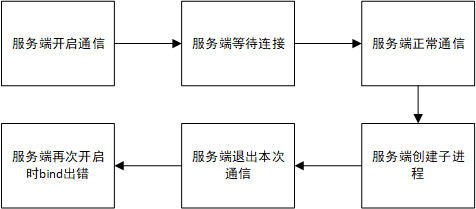
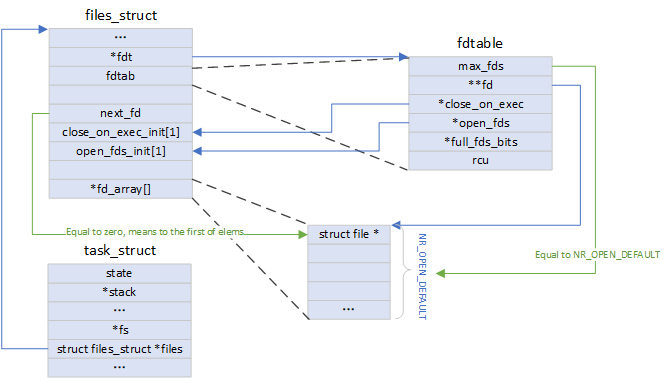
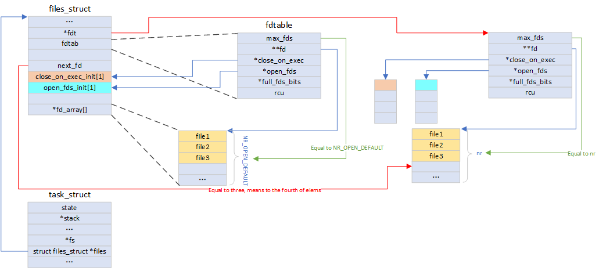
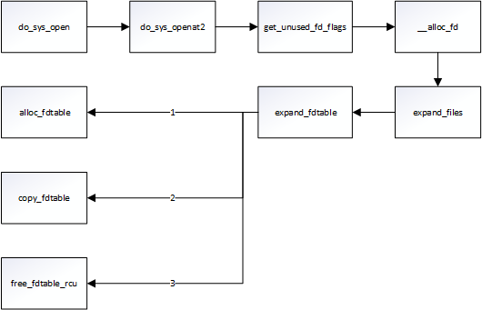

# 都是继承惹的祸

> 文章最后有知识点彩蛋哟 :heart_eyes:
>
> > [CLOEXEC原理](#补充知识点1——CLOEXEC原理)
> >
> > [文件的底层表示](#补充知识2——文件的底层表示)
> >
> > [其他需关注的继承](#补充知识点3——其他需关注的继承)

在多进程的工程中，通常会遇到启动进程的场景，但是若不清楚子进程对父进程的继承内容，很容易碰到令人困惑的问题，如下是一个很好的例子：

```c
#include <stdio.h>
#include <string.h>
#include <sys/socket.h>
#include <netinet/in.h>
#include <pthread.h>
#include <unistd.h>

void msg_process(int sockfd)
{
    //not important, just read the souce file
}

void *remote_process(void *arg)
{
	int sockfd;
    struct sockaddr_in server_addr;
	while (1) {
		if ((sockfd = socket(AF_INET, SOCK_STREAM, 0)) == -1) {
			perror("socket error");
			return NULL;
		}
		memset(&server_addr, 0, sizeof(server_addr));
		
		server_addr.sin_family = AF_INET;
		server_addr.sin_port = htons(1234);
		server_addr.sin_addr.s_addr = INADDR_ANY;
		if (bind(sockfd, (struct sockaddr *) &server_addr, sizeof(struct sockaddr)) == -1) {
			perror("bind error");
			return NULL;
		}
		if (listen(sockfd, 10) == -1) {
			perror("listen error");
			return NULL;
		}
		msg_process(sockfd);
	}

    return NULL;
}

void *sub_process(void *arg)
{
	//not important, just read the souce file
}

int main()
{
	pthread_t tid1, tid2;
	printf("test: remote_process started!\n");
    pthread_create(&tid1, NULL, remote_process, NULL);
	sleep(5);
	printf("test: sub_process start!\n");
	pthread_create(&tid2, NULL, sub_process, NULL);
	pthread_join(tid2, NULL);
    pthread_join(tid1, NULL);
	return 0;
}
```

这是一个socket通信服务端的简单例子（源码位于code/server.c），它触发了一个线程负责和客户端进行通信（源码位于code/client.c），当客户端发送quit后就会终止掉与服务端的会话，服务端此时重新等待新的客户端连接。当然，这是一个懒散的服务端，每次只和一个客户端“交流”。不仅如此，它还一心二用地在和客户端“交流”的过程中又用一个线程去fork子进程，拿着公家的钱还赚着外快，可真不厚道啊。接下来不妨看下服务端这么做的结果：

```shell
$ bash build.sh
$ bash start.sh
test: remote_process started!
msg_process started!
server: got connection
send: Hello, world!
server received: Hello, world!
test: sub_process start!
send: quit!
test: test_fork end
server received: quit!
bind error: Address already in use
test_program: is me
^Cget signal
Killed
```

在看到服务端`bind error`的结果后，就可以Ctrl+C杀死他们了，毕竟服务程序已经得到了应有的惩罚。这里可以结合打印来分析整个流程：



从流程上也不难看出，是服务端创建子进程这个奇怪的举动让它遭受了滑铁卢，当然在实际工程应用上并不能这么清晰地看到这个流程，假如是两部分人进行的开发，往往就会因为别人因需要起的子进程而造成自己程序的异常。那么，是否有方法做到在这种情况下不被别的进程所影响呢？在Linux上提供了`FD_CLOEXEC`用于修饰想子进程在`exec`类函数执行后自动关闭的描述符，在源码中有比较清晰的标注：

```c
#ifdef USE_SOCK_CLOEXEC
		if ((sockfd = socket(AF_INET, SOCK_STREAM | SOCK_CLOEXEC, 0)) == -1) {
#else
        if ((sockfd = socket(AF_INET, SOCK_STREAM, 0)) == -1) {
#endif
			perror("socket error");
			return NULL;
		}
#ifdef USE_FD_CLOEXEC
        fcntl(sockfd, F_SETFD, FD_CLOEXEC);
#endif
```

无论放开`USE_SOCK_CLOEXEC`或者`USE_FD_CLOEXEC`都可以达到解决`bind error`问题的目的，感兴趣的朋友不妨验证一下（注意：第一次可能还是会失败，原因在于上一次执行时还未指定`FD_CLOEXEC`，所以端口还是被占用了的）。

值得一提的是，实际上针对`bind error`这个单一的问题，还可以使用`setsockopt`设置`SO_REUSEPORT`来彻底解决，但是这自然不是本节关注的重点。


## 补充知识点1——CLOEXEC原理

前面已经猜测到了这个问题发生的原因并找到了解决该问题的方法，那么这里将探究下这个问题的底层因素和解决原理。


上图展示了内核底层的相关流程，当进程通过`fork`创建子进程时，由于子进程`dup_fd`的作用，导致父进程的文件描述符被子进程继承，造成本文的`bind error`问题，继承后的关系图如下：


而当`FD_CLOEXEC`被设置后，将会在子进程调用`exec`相关函数时，执行到`do_close_on_exec`，从而关闭相关的文件描述符，此处相关代码如下：

```c
void do_close_on_exec(struct files_struct *files)
{
	unsigned i;
	struct fdtable *fdt;

	/* exec unshares first */
	spin_lock(&files->file_lock);
	for (i = 0; ; i++) {
		unsigned long set;
		unsigned fd = i * BITS_PER_LONG;
		fdt = files_fdtable(files);
		if (fd >= fdt->max_fds)
			break;
		set = fdt->close_on_exec[i];
		if (!set)
			continue;
		fdt->close_on_exec[i] = 0;
		for ( ; set ; fd++, set >>= 1) {
			struct file *file;
			if (!(set & 1))
				continue;
			file = fdt->fd[fd];
			if (!file)
				continue;
			rcu_assign_pointer(fdt->fd[fd], NULL);
			__put_unused_fd(files, fd);
			spin_unlock(&files->file_lock);
			filp_close(file, files);
			cond_resched();
			spin_lock(&files->file_lock);
		}

	}
	spin_unlock(&files->file_lock);
}
//--------------------------------------------------------------------------------fs/file.c
static long do_fcntl(int fd, unsigned int cmd, unsigned long arg,
		struct file *filp)
{
	void __user *argp = (void __user *)arg;
	struct flock flock;
	long err = -EINVAL;

	switch (cmd) {
	...
	case F_SETFD:
		err = 0;
		set_close_on_exec(fd, arg & FD_CLOEXEC);
		break;
	...
	default:
		break;
	}
	return err;
}
//--------------------------------------------------------------------------------fs/fcntl.c
void set_close_on_exec(unsigned int fd, int flag)
{
	struct files_struct *files = current->files;
	struct fdtable *fdt;
	spin_lock(&files->file_lock);
	fdt = files_fdtable(files);
	if (flag)
		__set_close_on_exec(fd, fdt);
	else
		__clear_close_on_exec(fd, fdt);
	spin_unlock(&files->file_lock);
}
static inline void __set_close_on_exec(unsigned int fd, struct fdtable *fdt)
{
	__set_bit(fd, fdt->close_on_exec);
}
//--------------------------------------------------------------------------------fs/file.c
```


## 补充知识2——文件的底层表示

通过前面的内容可以看出，文件描述符的继承会产生一些问题，那么文件描述符或者说文件本身在Linux底层代表的含义究竟是什么则是这里要讨论的问题。

内核使用三种数据结构表示打开的文件，它们之间的关系决定了在文件共享方面一个进程对另一个进程可能产生的影响。

1. 每个进程在进程表中都有一个记录项，记录项中包含一张打开文件描述符表，与每个文件描述符表相关联的是文件描述符标志（`close_on_exec`）和指向一个文件表项的指针，是**进程级**的数据结构，在前面内容中所展示的父子进程表项就是其形象化的图示；
2. 内核为所有打开文件维护一张文件表，与每个文件表相关联的是文件状态标志（读、写、同步、非阻塞等）、当前文件偏移量和指向文件`i-node`节点表项的指针，是**系统级**的数据结构，在前面内容中所展示的文件表就是其形象化的图示；
3. 每个打开的文件对应一个`i-node`数据结构，包含了文件的所有者、文件长度、指向文件实际数据块在磁盘上所在位置的指针等，是**系统级**的数据结构。

接下来介绍这三种数据结构在内核代码中的表示：

1. 进程中的文件：

```c
struct task_struct {
	/* -1 unrunnable, 0 runnable, >0 stopped: */
	volatile long			state;
	...
	struct list_head		tasks;
	...
	pid_t				pid;
	...
	/* Filesystem information: */
	struct fs_struct		*fs;

	/* Open file information: */
	struct files_struct		*files;
	...
};
//--------------------------------------------------------------------------------include/linux/sched.h
struct files_struct {
	atomic_t count;
	bool resize_in_progress;
	wait_queue_head_t resize_wait;

	struct fdtable __rcu *fdt;
	struct fdtable fdtab;
	spinlock_t file_lock ____cacheline_aligned_in_smp;
	unsigned int next_fd;
	unsigned long close_on_exec_init[1];
	unsigned long open_fds_init[1];
	unsigned long full_fds_bits_init[1];
	struct file __rcu * fd_array[NR_OPEN_DEFAULT];
};
//--------------------------------------------------------------------------------include/linux/fdtable.h
```

在Linux中，对于每一个进程，都会分配一个PCB（Process Control Block）数据结构，它其中包含了该进程的所有信息，而在代码实现上，这个数据结构名为`task_struct`，部分成员已截出来放在上面的代码片段中。而`files`成员则是本节的重点，其结构体定义`struct files_struct`也被展示在上面的代码片段中，是接下来要讨论的**第一层数据结构**，其成员`fdtab`就是进程的文件描述符表。值得多提一下的是，`fdtab`这个结构实际上有一些比较绕的定义和用法，为了方便后面内容的介绍，这里将会解释这个较绕的逻辑。

话说天地初开时，诞生了Linux系统中的第一个进程——init进程，它是所有进程的祖先，而通过前面的知识又知道，父子进程间的文件描述符是继承的，那么不妨先看下祖先是如何定义的进程中的文件的：

```c
struct task_struct init_task
= {
	.state		= 0,
	.stack		= init_stack,
	...
	.fs		= &init_fs,
	.files		= &init_files,
    ...
};
EXPORT_SYMBOL(init_task);
//--------------------------------------------------------------------------------init/init_task.c
struct files_struct init_files = {
	.count		= ATOMIC_INIT(1),
	.fdt		= &init_files.fdtab,
	.fdtab		= {
		.max_fds	= NR_OPEN_DEFAULT,
		.fd		= &init_files.fd_array[0],
		.close_on_exec	= init_files.close_on_exec_init,
		.open_fds	= init_files.open_fds_init,
		.full_fds_bits	= init_files.full_fds_bits_init,
	},
	.file_lock	= __SPIN_LOCK_UNLOCKED(init_files.file_lock),
	.resize_wait	= __WAIT_QUEUE_HEAD_INITIALIZER(init_files.resize_wait),
};
//--------------------------------------------------------------------------------fs/file.c
```

乍一看初值都赋得亲爸亲妈都不认识了，想到后代们要继承这玩意儿真是为他们发愁，此时不妨先画图解析一波：



即使清楚了指针指向，可是依然很蒙圈，明明单一的files_struct就可以说明的问题，非要再搞个`fdtable`相互指一下？实际上，这是为了后续的扩展所做的，下面是扩展后的一种图示：



其中，颜色相同的`close_on_exec_init`、`open_fds_init`以及`fd_array`（前三个元素）意味着它们在扩展时进行了拷贝，而红色的指针指向意味着扩展后指针或元素含义进行了变动。因此，增加`fdtable`可以通过改变指针指向实现动态扩展进程表项，非常灵活。具体地，感兴趣的朋友可以遵循如下函数调用进行源码阅读：



上面提到的进程表项`fd_array`的每一项为`struct file *`结构，它就是接下来套讨论的**第二层数据结构**。源码展示如下：

```c
struct file {
	...
	struct inode		*f_inode;	/* cached value */
	const struct file_operations	*f_op;
	...
	unsigned int 		f_flags;
	...
	loff_t			f_pos;
	...
} __randomize_layout
  __attribute__((aligned(4)));
```

其比较重要的成员即为`f_flags`（文件打开标志，读/写/阻塞/非阻塞/同步等）、`f_pos`（文件当前读写位置）、`*f_op`（了解驱动的朋友可能不陌生，这就是驱动层需要描述的设备操作函数集）和`*f_inode`。那么`*f_inode`就是再往下的**第三层数据结构**——`struct inode`，其源码定义如下：

```c
struct inode {
	umode_t			i_mode;
	unsigned short		i_opflags;
	kuid_t			i_uid;
	kgid_t			i_gid;
	unsigned int		i_flags;
	...
	const struct inode_operations	*i_op;
	...
	loff_t			i_size;
	struct timespec64	i_atime;
	struct timespec64	i_mtime;
	struct timespec64	i_ctime;
	...
} __randomize_layout;
```

这个结构存放了内核在操作文件或目录时所需要的全部信息，是虚拟文件系统所使用的一个对象，可以通过`ls -li`命令看到许多和它内部成员相关的变量，如`i_mode`（文件的访问权限eg:rwxrwxrwx）、`i_ino`（inode号）、`i_size`（文件大小）、`i_atime`（最近一次访问文件的时间）、`i_mtime`（最近一次修改文件的时间）和`i_ctime`（最近一次修改inode的时间）等。除此之外，还可以用`stat`命令来查看某一文件的`inode`信息，命令结果如下：

```shell
$ ls -li
总用量 8
1688849860425957 -rwxrwxrwx 1 callon callon   98 3月   5 22:26 build.sh
1688849860425943 -rwxrwxrwx 1 callon callon 1028 3月   3 23:57 client.c
1688849860425838 -rwxrwxrwx 1 callon callon 2375 3月   5 23:16 server.c
2251799813847988 -rwxrwxrwx 1 callon callon  366 3月   5 22:25 start.sh
1688849860425956 -rwxrwxrwx 1 callon callon  154 3月   3 23:00 subprocess.c
$ stat build.sh
  文件：build.sh
  大小：98              块：0          IO 块：4096   普通文件
设备：fh/15d    Inode：1688849860425957  硬链接：1
权限：(0777/-rwxrwxrwx)  Uid：( 1000/  callon)   Gid：( 1000/  callon)
最近访问：2021-03-05 22:26:09.786153000 +0800
最近更改：2021-03-05 22:26:09.786153000 +0800
最近改动：2021-03-05 22:26:09.786153000 +0800
创建时间：-
```


## 补充知识点3——其他需关注的继承

这里只会列出应用开发经常需要关注到的一些：

- 环境变量
- 信号处理
- 当前工作目录
- 资源限制

所有这些继承都可以通过`copy_process`函数进行验证，而且是否继承完全取决于`clone_flags`，了解这些后将会对进程底层有更深的理解。如进程和线程很大的不同在于`clone_flags`是否指定了`CLONE_VM`，并且线程由于共享了进程的虚拟内存区域，因而线程切换时也将更加“轻便”，所以称之为轻量级进程。

