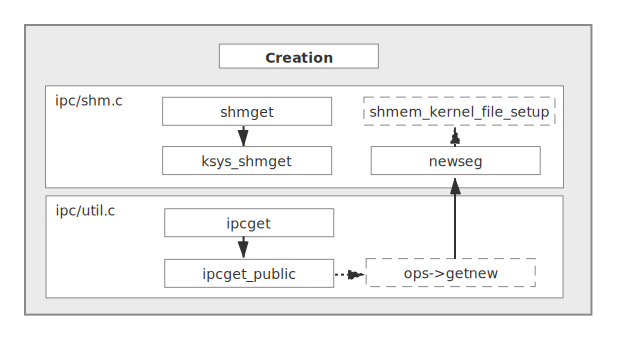
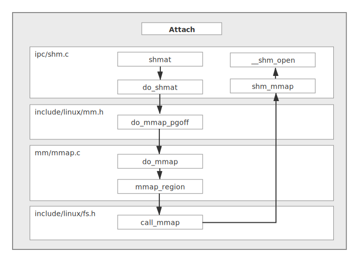
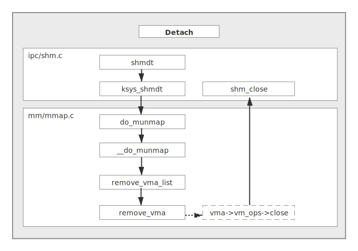
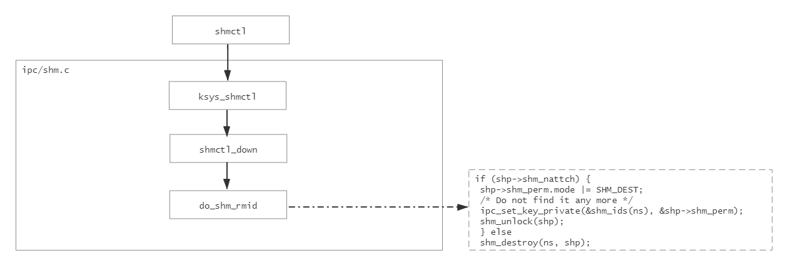
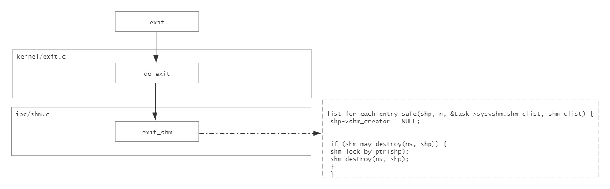

# 细数IPC的坑

## Content

- [简介](#简介)
- [mqueue](#mqueue)
  - [`mq_open`](#mq_open)
  - [`mq_timedxxx`](#mq_timedxxx)
- [socket](#socket)
  - [*SO_SNDTIMEO* / *SO_RCVTIMEO* / `select`](#so_sndtimeo--so_rcvtimeo--select) 
- [condition_variable](#condition_variable)
- [share_memory](#share_memory)
  - [`shmctl`](#shmctl)
- [附-socket+mqueue=Ipc类](#附-socket+mqueue=Ipc类)
- [附-共享内存的底层实现概要](#附-共享内存的底层实现概要)
  - [`shmget` 实现概要](#shmget-实现概要)
  - [`shmat` 实现概要](#shmat-实现概要)
  - [`shmdt` 实现概要](#shmdt-实现概要)
- [附-shmctl删除共享内存的源码分析](#附-shmctl删除共享内存的源码分析)

---

## 简介

进程间通信（*Inter-Process Communication*）的使用是Linux应用开发中不可避免的一环，那么在工程应用中使用 *IPC* 有哪些注意的点是本节描述的重点。

## mqueue

### `mq_open`

在工程应用中，随着需求和代码量的增大，比较容易出现文件描述符超出限制的情况，对于POSIX消息队列来说，其错误则可能为 *EMFILE*。产生这种错误的原因一般有两点：

- 文件描述符超出限制
- 消息队列大小超出了总大小限制

在工程中，可以通过如下几个命令进行确认是两个问题中的哪一种，方便对于具体问题进行修正：

```shell
$ ls -al /proc/$pid/fd | wc -l
      123
$ ulimit -a
core file size          (blocks, -c) 0
data seg size           (kbytes, -d) unlimited
file size               (blocks, -f) unlimited
pending signals                 (-i) 1024
max locked memory       (kbytes, -l) 32
max memory size         (kbytes, -m) unlimited
open files                      (-n) 1024
pipe size            (512 bytes, -p) 8
POSIX message queues     (bytes, -q) 819200
stack size              (kbytes, -s) 10240
cpu time               (seconds, -t) unlimited
max user processes              (-u) 4096
virtual memory          (kbytes, -v) unlimited
file locks                      (-x) unlimited
$ mkdir /mnt/mqueue;mount -t none mqueue /mnt/mqueue
$ cat /mnt/mqueue/*
QSIZE:129 NOTIFY:2 SIGNO:0 NOTIFY_PID:8260
...
```

1. 对于文件描述符是否超出限制，可以使用第一个 `ls` 命令结合第二个 `ulimit` 命令的方式查看
2. 如果不是文件描述符的个数限制，基本可以往 “消息队列大小超出了总大小限制” 这个方向排查，第三和第四个命令只能看到当前系统各个消息队列缓存的大小，即 *QSIZE* ，并不能看到申请的大小总和（至少当前Linux默认不会将其展示出来），因此完全下结论需要将所有的 `mq_open` 进行捕获并累加

解决方法也不难，只需要在应用层使用 `setrlimt` 函数修改限制即可：

```c
struct rlimit r;
getrlimit(RLIMIT_MSGQUEUE, &r);
r.rlim_cur = r.rlim_max = (20<<20);
setrlimt(RLIMIT_MSGQUEUE, &r);
```

### *mq_timedxxx*

在消息队列接收/发送数据时，通常使用的接口是 `mq_receive` / `mq_send`，默认是阻塞的，当开发人员需要使用带超时时间的接收/发送函数时，就需要使用 `mq_timedreceive` / `mq_timedsend` 。

值得注意的是，它们和常见的超时函数不同， `mq_timedreceive` / `mq_timedsend` 使用的是 `struct timespec` 结构，只能指定秒和纳秒两种单位的时间，且它们所指的超时是针对当前时间而言的，下面列出了其正确的使用方式：

```c
struct timespec abs_timeout;
clock_gettime(CLOCK_REALTIME, &abs_timeout);
/* timeout：ms */
abs_timeout.tv_sec += timeout / 1000;
abs_timeout.tv_nsec += (timeout % 1000) * 1000 * 1000;
if (abs_timeout.tv_nsec > 1000000000) {
    abs_timeout.tv_nsec -= 1000000000;
    abs_timeout.tv_sec += 1;
}
#if SEND
ret = mq_timedsend(ipc_info_.ipc_mq, buf, len, 50, &abs_timeout);
#else
ret = mq_timedreceive(ipc_info_.ipc_mq, buf, len, nullptr, &abs_timeout);
#endif
```

注意对 `tv_nsec` 大于 *1000000000* 的处理，因为当 `tv_nsec` 大于 *1000000000* 时，应当 “进位” 为 `tv_sec` 。

---

## socket

### *SO_SNDTIMEO* / *SO_RCVTIMEO* / `select`

和 *mq_timedxxx* 如出一辙，`socket` 使用中也不免要对 `recv` / `recvfrom` / `accept` / `send` / `sendto` / `connect` 进行超时设定，这一般在应用上需要通过 `setsockopt` 函数来完成，当然如果需要更加准确的超时，那么 `select` 是一个更好的选择：

```c++
#if SEND
struct timeval value;
socklen_t value_len = sizeof(value);
int sock_ret;
/* timeout：ms */
int sec = timeout / 1000;
int usec = (timeout % 1000) * 1000;
sock_ret = getsockopt(ipc_info_.socket, SOL_SOCKET, SO_SNDTIMEO, (char *)&value, &value_len);
if ((sock_ret != 0) || (value.tv_sec != sec)
    || (value.tv_usec != usec)) {
    value.tv_sec  = sec;
    value.tv_usec = usec;
    if (sock_ret != 0) LOG_WARN("getsockopt failed, error = %d(%s).\n", errno, strerror(errno));
    /* do not need most accurate. */
    sock_ret = setsockopt(ipc_info_.socket, SOL_SOCKET, SO_SNDTIMEO, (char *)&value, value_len);
    if (sock_ret != 0) LOG_WARN("setsockopt failed, error = %d(%s).\n", errno, strerror(errno));
}
ret = sendto(ipc_info_.socket, buf, len, 0, (struct sockaddr *)&addr, addr_len);
#else
struct timeval value;
int select_ret;
fd_set fds;
FD_ZERO(&fds);
FD_SET(ipc_info_.socket, &fds);
value.tv_sec  = timeout / 1000;
value.tv_usec = (timeout % 1000) * 1000;
/* more accurate than setsockopt */
select_ret = select(ipc_info_.socket+1, &fds, nullptr, nullptr, &value);
if (0 == select_ret) {
    return 0;
} else if (-1 == select_ret) {
    //LOG_ERROR("select failed, error = %d(%s).\n", errno, strerror(errno));
    return 0;
}
ret = recvfrom(ipc_info_.socket, buf, len, 0, (struct sockaddr *)&addr, &addr_len);
#endif
```

值得注意的是，其超时结构为 `struct timeval` 只能指定秒和微秒两种单位的时间。

## condition_variable

条件变量一般用于多线程间的同步操作，C++11以后一般使用 `std::condition_variable`  ，而C语言上则直接使用 `pthread_cond_t` 。虽然只是简单的同步，但是其中也有一些匪夷所思的奇怪现象，先来看一个例子（对应code文件夹中的 *test1.cpp*）：

```c++
#include <functional>
#include <memory>
#include <thread>
#include <queue>
#include <iostream>
#include <mutex>
#include <condition_variable>
#include <semaphore.h>
#include <unistd.h>

bool ready = false;
std::mutex mutex_thread;
std::condition_variable cond;

std::shared_ptr<std::thread> thread_wait;
std::shared_ptr<std::thread> thread_notify;

void *wait_routine(void)
{
    while (true) {
        std::unique_lock<std::mutex> lock(mutex_thread);
        while (!ready)
            cond.wait(lock);
        ready = false;
        std::cout << "waited!" << std::endl;
        std::this_thread::sleep_for(std::chrono::milliseconds(30));
    }
    return nullptr;
}
#ifdef USE_FUNC
void notify()
{
    std::unique_lock<std::mutex> lock(mutex_thread);
    ready = true;
    cond.notify_all();
}
#endif
void *notify_routine()
{
    while (true) {
#ifdef USE_FUNC
        notify();
#else
        std::unique_lock<std::mutex> lock(mutex_thread);
        ready = true;
    	cond.notify_all();
#endif
        std::cout << "is ready" << std::endl;
        std::this_thread::sleep_for(std::chrono::milliseconds(40));
    }
    return nullptr;
}

int main()
{
    thread_wait = std::make_shared<std::thread>(&wait_routine);
    thread_notify = std::make_shared<std::thread>(&notify_routine);
    thread_wait->join();
    thread_notify->join();
    return 0;
}
```

这个例子想要强调的部分很明显，就是用 `USE_FUNC` 宏包住的部分，差异仅仅在于是否使用函数调用，下面不妨看看运行上的差异：

```shell
$ g++ test1.cpp -o test1 -lpthread
$ ./test1
is ready
is ready
is ready
is ready
is ready
is ready
is ready
...
^C
$ g++ -DUSE_FUNC test1.cpp -o test1 -lpthread
$ ./test1
is ready
waited!
is ready
waited!
is ready
waited!
is ready
waited!
...
```

造成该现象的原因就是对 `std::unique_lock<std::mutex>` 理解得不深刻，它会在作用域消失时解锁，却在刚解锁后直接加锁，从而造成 `notify_routine` 这个线程一直占用锁打印的问题。

当然，这不是本小题的重点，下面这个例子才是：

```c++
#include <functional>
#include <memory>
#include <thread>
#include <queue>
#include <iostream>
#include <mutex>
#include <condition_variable>
#include <semaphore.h>
#include <unistd.h>

typedef struct {
    struct {
        uint32_t width;
        uint32_t height;
        int field;
        int pformat;
        int vformat;
        int cmode;
        int drange;
        int cmnt;
        uint32_t header[3];
        uint32_t stride[3];
        uint32_t extstride[3];

        uint64_t headerphy[3];
        uint64_t headervir[3];
        uint64_t phyaddr[3];
        uint64_t viraddr[3];
        uint64_t extphyaddr[3];
        uint64_t extviraddr[3];

        int16_t offsettop;
        int16_t offsetbottom;
        int16_t offsetleft;
        int16_t offsetright;

        uint32_t max;
        uint32_t min;

        uint32_t timeref;
        uint64_t pts;

        uint64_t pdata;
        uint32_t framef;
    };
    uint32_t id;
    int mode;
} INFO;

std::mutex mutex_queue1;
std::queue<INFO> queue1;
std::mutex mutex_queue2;
std::queue<INFO> queue2;

#ifdef SEM
sem_t sem;
#else
std::mutex mutex_thread;
std::condition_variable cond;
#endif
bool ready = false;

std::shared_ptr<std::thread> thread_wait;
std::shared_ptr<std::thread> thread_notify1;
std::shared_ptr<std::thread> thread_notify2;

void *wait_routine(void)
{
    while (true) {
#ifdef SEM
        sem_wait(&sem);
#else
        std::unique_lock<std::mutex> lock(mutex_thread);
        while (!ready)
            cond.wait(lock);
        ready = false;
#endif
        std::cout << "waited!" << std::endl;
        std::unique_lock<std::mutex> lock1(mutex_queue1);
        std::unique_lock<std::mutex> lock2(mutex_queue2);
        if (queue1.size() > 0 && queue2.size() > 0) {
            queue1.pop();
            queue2.pop();
            //do something
            std::this_thread::sleep_for(std::chrono::milliseconds(20));
        }
    }
    return nullptr;
}
#ifndef SEM
void notify()
{
    std::unique_lock<std::mutex> lock(mutex_thread);
    ready = true;
    cond.notify_all();
}
#endif
void *notify_routine(int idx)
{
    while (true) {
        INFO info;
        if (1 == idx) {
            std::unique_lock<std::mutex> lock1(mutex_queue1);
            queue1.push(info);
            if (queue1.size() > 4)
                queue1.pop();
        } else {
            std::unique_lock<std::mutex> lock2(mutex_queue2);
            queue2.push(info);
            if (queue2.size() > 4)
                queue2.pop();
        }
#ifdef SEM
        sem_post(&sem);
#else
        notify();
#endif
        std::cout << idx << "is ready" << std::endl;
        std::this_thread::sleep_for(std::chrono::milliseconds(40));
    }
    return nullptr;
}

int main()
{
#ifdef SEM
    sem_init(&sem, 0, 0);
#endif
    thread_wait = std::make_shared<std::thread>(&wait_routine);
    thread_notify1 = std::make_shared<std::thread>(&notify_routine, 1);
    thread_notify2 = std::make_shared<std::thread>(&notify_routine, 2);
    thread_wait->join();
    thread_notify1->join();
    thread_notify2->join();
    return 0;
}
```

这是一个真实发生的案例，因此数据结构这里也尽量保证了真实，实现的事情很简单：

> 当两个生产者都产生东西后，消费者将其一同取出组装
>
> 实现思路为：每次生产者生产完成都会给消费者发信号查看，消费者查看都存在东西后进行处理。

从逻辑上看也没有任何问题，接下来运行看看：

```shell
$ g++ test2.cpp -o test2 -lpthread
$ ./test2
...
is ready
2is ready
waited!
1is ready
waited!
2is ready
waited!
...
```

虽然很难，但是确实有一定几率会出现，两次 *ready* 但是只有一次 *wait* 的情况，感兴趣的朋友可以直接改下程序用计数的方式打印出来，会更加明显。

这不禁让人怀疑，莫非是消费者耗时太长导致的？这里不妨看下将消息队列改为信号量的结果：

```shell
$ g++ -DSEM test2.cpp -o test2 -lpthread
$ ./test2
$ ./test2
2is ready
waited!
1is ready
waited!
2is ready
waited!
1is ready
waited!
...
```

得到的答案非常工整，那么原因只能出在 `condition_variable` 本身了：

> `pthread_cond_signal` 函数的作用是发送一个信号给另外一个正在处于阻塞等待状态的线程，使其脱离阻塞状态，继续执行。
>
> 如果没有线程处在阻塞等待状态，`pthread_cond_signal` 也会成功返回。

不难看出，该现象的原因在于线程在非阻塞等待的时候返回了，此时程序也认为是 *ready* 打印了，所以造成计数的不一致，而信号量由于是原子操作，不存在 “信号错过” 这种问题，信号量的值是在正常被累加的。但是这里值得警醒的是，信号量值 *OVERFLOW* 的问题：

```shell
SEM_POST(3)                                   Linux Programmer's Manual                                   SEM_POST(3)

NAME
       sem_post - unlock a semaphore

SYNOPSIS
       #include <semaphore.h>

       int sem_post(sem_t *sem);

       Link with -pthread.

DESCRIPTION
       sem_post()  increments  (unlocks)  the  semaphore  pointed  to  by sem.  If the semaphore's value consequently
       becomes greater than zero, then another process or thread blocked in a sem_wait(3) call will be woken  up  and
       proceed to lock the semaphore.

RETURN VALUE
       sem_post()  returns  0 on success; on error, the value of the semaphore is left unchanged, -1 is returned, and
       errno is set to indicate the error.

ERRORS
       EINVAL sem is not a valid semaphore.

       EOVERFLOW
              The maximum allowable value for a semaphore would be exceeded.
```

从 `man sem_post` 不难看出，若溢出会造成 `sem_post` 返回失败，想查看设计的系统中是否有溢出的风险，可以每次 `sem_post` 后使用 `sem_getvalue` 将信号量的值打印出来，若出现值一直累加的情况，那么将有极大的溢出风险，将本例的延时进一步修改后将得到溢出问题的案例：

```diff
...
void *wait_routine(void)
{
    while (true) {
#ifdef SEM
        sem_wait(&sem);
#else
        std::unique_lock<std::mutex> lock(mutex_thread);
        while (!ready)
            cond.wait(lock);
        ready = false;
#endif
        std::cout << "waited!" << std::endl;
        std::unique_lock<std::mutex> lock1(mutex_queue1);
        std::unique_lock<std::mutex> lock2(mutex_queue2);
        if (queue1.size() > 0 && queue2.size() > 0) {
            queue1.pop();
            queue2.pop();
            //do something
-           std::this_thread::sleep_for(std::chrono::milliseconds(20));
+           std::this_thread::sleep_for(std::chrono::milliseconds(40));
        }
    }
    return nullptr;
}
#ifndef SEM
void notify()
{
    std::unique_lock<std::mutex> lock(mutex_thread);
    ready = true;
    cond.notify_all();
}
#endif
void *notify_routine(int idx)
{
    while (true) {
        INFO info;
        if (1 == idx) {
            std::unique_lock<std::mutex> lock1(mutex_queue1);
            queue1.push(info);
            if (queue1.size() > 4)
                queue1.pop();
        } else {
            std::unique_lock<std::mutex> lock2(mutex_queue2);
            queue2.push(info);
            if (queue2.size() > 4)
                queue2.pop();
        }
#ifdef SEM
        sem_post(&sem);
+       int sval;
+       sem_getvalue(&sem, &sval);
+       std::cout << sval << std::endl;
#else
        notify();
#endif
        std::cout << idx << "is ready" << std::endl;
-       std::this_thread::sleep_for(std::chrono::milliseconds(40));
+       std::this_thread::sleep_for(std::chrono::milliseconds(10));
    }
    return nullptr;
}
...
```

修改后得到的运行结果如下：

```shell
$ g++ -DSEM test2.cpp -o test2 -lpthread
$ ./test2
1
1is ready
waited!
2
2is ready
waited!
1
2is ready
2
1is ready
waited!
2
2is ready
3
1is ready
waited!
3
2is ready
4
...
```

所以，使用信号量依然是不安全的，那该如何是好？

其实，前面使用条件变量的例子若是仔细分析是可以发现存在实现方式不对的问题的，既然想要等待两个都就绪，等待的条件就不应该是某一个就绪：

```diff
...

#ifdef SEM
sem_t sem;
#else
std::mutex mutex_thread;
std::condition_variable cond;
#endif
-bool ready = false;

std::shared_ptr<std::thread> thread_wait;
std::shared_ptr<std::thread> thread_notify1;
std::shared_ptr<std::thread> thread_notify2;

void *wait_routine(void)
{
    while (true) {
#ifdef SEM
        sem_wait(&sem);
#else
        std::unique_lock<std::mutex> lock(mutex_thread);
-       while (!ready)
+       while (!(queue1.size() > 0 && queue2.size() > 0))
            cond.wait(lock);
-       ready = false;
#endif
        std::cout << "waited!" << std::endl;
        std::unique_lock<std::mutex> lock1(mutex_queue1);
        std::unique_lock<std::mutex> lock2(mutex_queue2);
-       if (queue1.size() > 0 && queue2.size() > 0) {
            queue1.pop();
            queue2.pop();
            //do something
            std::this_thread::sleep_for(std::chrono::milliseconds(20));
-       }
    }
    return nullptr;
}
#ifndef SEM
void notify()
{
    std::unique_lock<std::mutex> lock(mutex_thread);
-   ready = true;
    cond.notify_all();
}
#endif
...
```

这样就会得到每两个 `notify` 响应一次 `wait` 的情况，但是这个是正确且想要达到的效果。

```shell
$ g++ test2.cpp -o test2 -lpthread
$ ./test2
1is ready
2is ready
waited!
1is ready
2is ready
waited!
1is ready
2is ready
waited!
1is ready
2is ready
waited!
1is ready
2is ready
waited!
```

## share_memory

### `shmctl`

在工程应用中，当需要较多数据共享时，共享内存是普遍接受和使用的方式，但是若是对其了解不深入，将会陷入莫名其妙的困境：

```c++
#include <sys/ipc.h>
#include <sys/shm.h>
#include <stdio.h>
#include <string.h>
#include <errno.h>

#define KEY_PATH "/usr"

#define CHECK_FUNC_RET(cond, ret, ...) {    \
    if (cond) {                             \
        printf(__VA_ARGS__);                \
        return ret;                         \
    }                                       \
}

int main()
{
    int key = ftok(KEY_PATH, 0);
    int shm_id = shmget(key, 1024, IPC_CREAT | IPC_EXCL | 0666);//shmget(key, 1024, IPC_CREAT | 0666);
    CHECK_FUNC_RET(shm_id < 0, -1, "shmget failed, errno %d(%s)\n", errno, strerror(errno));
    void *addr = shmat(shm_id, nullptr, 0);
    CHECK_FUNC_RET(addr == (void *)-1, -1, "shmat failed, errno %d(%s)\n", errno, strerror(errno));
    struct shmid_ds shmds;
    shmctl(shm_id, IPC_STAT, &shmds);
    printf("no. of current attaches: %ld\n", shmds.shm_nattch);
#ifdef SHMDT
    shmdt(addr);
#endif
#ifndef NO_IPC_RMID
    shmctl(shm_id, IPC_RMID, nullptr);
#endif
    shm_id = shmget(key, 1024, IPC_CREAT | IPC_EXCL | 0666);
    CHECK_FUNC_RET(shm_id < 0, -1, "shmget failed, errno %d(%s)\n", errno, strerror(errno));
    addr = shmat(shm_id, nullptr, 0);
    CHECK_FUNC_RET(addr == (void *)-1, -1, "shmat failed, errno %d(%s)\n", errno, strerror(errno));
#ifdef SHMDT
    shmdt(addr);
#endif
    shmctl(shm_id, IPC_STAT, &shmds);
    printf("no. of current attaches: %ld\n", shmds.shm_nattch);
    shmctl(shm_id, IPC_RMID, nullptr);
    return 0;
}
```

这段代码看上去其实问题不大，即使在不放开 `SHMDT` 宏的情况下，也只是在映射虚拟内存后，没有及时解映射就删除了内存，但是事实当真如此吗？

```shell
$ g++ test3.cpp -o test3
$ ./test3
no. of current attaches: 1
shmget failed, errno 17(File exists)
$ ./test3
no. of current attaches: 1
shmget failed, errno 17(File exists)
$ g++ -DNO_IPC_RMID test3.cpp -o test3
$ ./test3
no. of current attaches: 1
shmget failed, errno 17(File exists)
$ ./test3
shmget failed, errno 17(File exists)
```

> 注：这里之所以错误的情况运行两次，是为了查看进程退出后是否共享内存依然存在

所以，根据运行结果可以得到如下结论：

1. 从第二次的 `shmget` 报错可以看出，在有人 *attach* 共享内存的情况下，即使使用 `shmctl` 的 `IPC_RMID` 命令也无法删除内存；
2. 从第二次运行 *test3* 进程，但是第一次 `shmget` 成功的情况下，可以看出，虽然当时无法删除共享内存，但是进程退出后会清除掉；
3. 从放开 `NO_IPC_RMID` 连续运行两次的结果可以看出，前面程序的错误和完全不调用 `shmctl` 还是存在差异的，完全不调用的情况下，共享内存即使在程序退出后依然存在。

因为放开 `NO_IPC_RMID` 后共享内存永远都存在了，无法删除，想要恢复的朋友可以放开注释掉的 `shmget` ，这样就能保证 `shmget` 不会因为排他而创建失败，然后正常去调用 `shmctl` 的 `IPC_RMID` 命令删除即可，这里不再多加赘述。

完全正常的调用，可以放开 `SHMDT` 宏得到：

```shell
$ g++ -DSHMDT test3.cpp -o test3
$ ./test3
no. of current attaches: 1
no. of current attaches: 0
```

但是经过不同平台上的实验发现（本例是在windows的ubuntu18.04的虚拟机上执行的），很多平台其实不会造成第二次 `shmget` 的失败，那么是否说明没有此问题呢？在这种情况下，本次程序在 `return` 之前加上 `sleep(100)` 来查看现象：

```shell
#Telnet terminal 1
BusyBox v1.18.4 (2019-10-22 14:01:18 CST) built-in shell (ash)
Revision: 64613
Enter 'help' for a list of built-in commands.

/ $ cd /home/
/home $ ./test3
no. of current attaches: 1
no. of current attaches: 1


#Telnet terminal 2
BusyBox v1.18.4 (2019-10-22 14:01:18 CST) built-in shell (ash)
Revision: 64613
Enter 'help' for a list of built-in commands.

/ $ cd /home/
/home $ cat /proc/sysvipc/shm
       key      shmid perms       size  cpid  lpid nattch   atime      dtime      ctime        rss       swap
  34606523          0   666     131072   655  1300      3   1626206911 1626206911         18   131072    0
 422676289      32769   666     626696   798  1300      1   1626206911 1626206911 1626206898   630784    0
 422676817      65538   666       3096   798  1300      1   1626206911 1626206911 1626206898   4096      0
...
         0    1507350  1666       1024  2431  2431      1   1626270502          0 1626270502   0         0
         0    1540119  1666       1024  2431  2431      1   1626270502          0 1626270502   0         0
...
```

> 注：为了更好地排版，这里去掉了 *uid、gid、cuid、cgid* 这四个字段。

可以发现，处于这种被标记状态下，虽然不会导致 `shmget` 同一个 *key* 失败（它们的 *key* 被置为了 0），但是内存确实没有被清除，问题依然是存在的。

该问题的源码分析可参见[附录](#附-shmctl删除共享内存的源码分析)。


---

## 附-socket+mqueue=Ipc类

在本节的code/ipc文件夹中给出了一个C++综合 `socket` 和 `mqueue` 实现的 *Ipc* 类，文中的部分代码片段也是截取自其中，供大家参考。


## 附-共享内存的底层实现概要

共享内存的底层主要涉及两种文件：*tmpfs* 文件和 *shm* 文件，共享内存的实体是一个 *tmpfs* 文件，当不同进程 *attach* 到共享内存时，就会产生不同的 *shm* 文件。这种实现方式的优势如下：

- 可以让某个进程删除共享内存后，其他进程能够继续正常使用；
- 可以在所有进程 *detach* 后，*tmpfs* 文件作为IPC资源又不会被删除。

下面通过 `shmget` 、`shmat` 和 `shmdt` 三个关键过程来挖掘共享内存背后的实现。

### `shmget` 实现概要



该函数的主要流程如上，最终的 `shmem_kernel_file_setup` 函数就是在 *tmpfs* 中创建共享内存文件。

### `shmat` 实现概要



从整个过程可以看出，映射的过程主要是创建 *shm* 文件以及映射虚拟地址的过程（包括映射 *shm* 文件和 *tmpfs* 文件），值得注意的是：

1. *shm_nattch* 字段的操作比较绕，在 `shmat` 开始时进行了 `++`，在退出时又 `--` 了，原因在于最终的 `++` 操作是在 `__shm_open` 中完成的；
2. 映射完成后，若对虚拟内存进行写操作，将会执行到 *tmpfs* 文件的缺页，即先到 `shm_fault` 再转发至 *tmpfs* 的缺页操作`sfd->vm_ops->fault` 上去。

### `shmdt` 实现概要



整个过程与`shmat` 几乎相反，取消 *tmpfs* 文件在进程的虚拟地址映射，并更新 *shm_nattch* 等字段，若此前有人使用过`shmctl` 的 `IPC_RMID` 命令，那么此处也会通过 `shm_destroy` 删除 *tmpfs* 文件。


## 附-shmctl删除共享内存的源码分析

由于该问题表现为 `shmctl` 函数未生效，这里可以以该函数作为入口：



这里可以清晰地看到，对于 *shm_nattch* 的取值不同，`shmctl` 最终的行为也不同，和之前理论分析一致：

- 对于 *shm_nattch* 为0的情况，会直接删除共享内存
- 在 *shm_nattch* 不为0的情况下，仅做一个 `SHM_DEST` 的标记

这个标记将会在进程退出时使用到：



```c
static bool shm_may_destroy(struct ipc_namespace *ns, struct shmid_kernel *shp)
{
	return (shp->shm_nattch == 0) &&
	       (ns->shm_rmid_forced ||
		(shp->shm_perm.mode & SHM_DEST));
}
```

从而使得进程退出后，能够正常删除共享内存。


