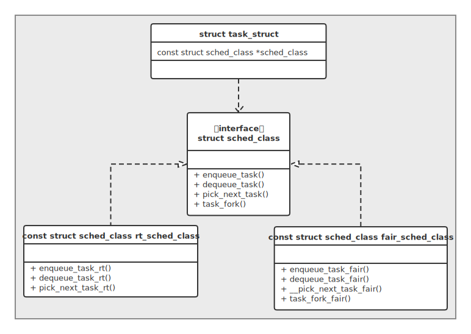

# 从优先级看调度

## Content

- [简介](#简介)
- [优先级的设置](#优先级的设置)
  - [优先级的取值](#优先级的取值)
  - [优先级的类别](#优先级的类别)


---

## 简介

作为一个应用开发人员，涉及进程调度的内容真的不多，其中优先级可能是一个合适的入口。

很多朋友可能在线程的优先级上是知道一些的，因为确实会考虑设置它们的优先级，但是进程却几乎不用设置，因为系统给了大家一个默认的调度器，不过在少数的场合下（对进程响应有更高的要求）也会对其进行设置，这也就是为什么TI公司在设计 [PCD（**P**rocess **C**ontrol **D**aemon）](https://sourceforge.net/p/pcd/code/HEAD/tree) 时将其作为了一个配置项，所以应用开发人员了解进程优先级时很有必要的。

本节参考PCD模块的配置，主要涉及两种调度：*FIFO* 和 *NICE* 。

## 优先级的设置

内核对于应用进程设置自己的运行优先级给了相应的系统调用接口，下面给出的设置优先级的例子是根据 [进程启动](../StartProcess) 的创建进程函数修改而来，这里只截取其中相关的一部分（完整程序在同级的 `code` 文件夹中可以看到）：

```c++
pid = fork();
if (pid < 0) {
    status = -1;
} else if (0 == pid) {
    ...
    /* Setup the priority of the process */
    {
        struct sched_param setParam;
        pid_t self_pid = getpid();
        if (sched_getparam(self_pid, &setParam) == 0) {
            if (NICE == priority->type) {
                setParam.sched_priority = 0;
                sched_setscheduler(self_pid, SCHED_OTHER, &setParam);
                setpriority(PRIO_PROCESS, 0, priority->value);
            } else {
                setParam.sched_priority = priority->value;
                sched_setscheduler(self_pid, SCHED_FIFO, &setParam);
            }
        }
    }
    sigprocmask(SIG_SETMASK, &save_mask, 0L);
    if (execvp(args[1], args + 1) < 0)
        exit(SIGABRT);
    _exit(127); /* exec error */
} else {
#ifndef NO_WAIT
    while (waitpid(pid, &status, 0) < 0) {
        if (errno != EINTR) {
            status = -1; /* error other than EINTR from waitpid() */
            break;
        }
    }
#endif
}
```

可以看到，针对 *NICE* 和 *FIFO* 两种类型，都是调用 `sched_setscheduler` 函数进行设置的，不过设置具体值时，*NICE* 额外调用了 `setpriority` 。

### 优先级的取值

在Linux系统中，*FIFO* 类型的优先级有时也称为实时进程优先级，而 *NICE* 则为非实时进程优先级，其取值范围如下：

|类型|作为参数的范围|内核转换后的范围|
|--|--|--|
|FIFO|0~99|0~99|
|NICE|-20~19|100~139|

参数和内核的转换范围可以跟踪 `setpriority` 系统调用来得到：


其中， `MAX_RT_PRIO` 就定义了最大的实时进程优先级，而真正优先级的范围为 `MAX_PRIO` ，是加上了 *NICE* （非实时进程）优先级所占跨度的结果，值为140。而 *NICE* 的范围也不难通过 `NICE_TO_PRIO` 宏计算出来。

### 优先级的类别

> 实际上，这里所说的 “优先级的类别” 其实就意味着调度器的类别。

通过跟踪 `sched_setscheduler` 系统调用函数就可以看到这个过程：


这里的 `sched_class` 就是调度器类别，它根据优先级的范围进行确定是哪种调度器，从面向对象的角度来看，这是定义了接口的设计模式：



> `rt_sched_class` 和 `fair_sched_class` 就是它的特化实现，前者又称为实时调度，后者又称为CFS（**C**ompletely **F**air **S**cheduler）。

进程的管理模块 `task_struct` 则需要包含/依赖它提供 “规则” 让调度器进行具体调度，如这里截取的四个比较重要的函数：

1. `enqueue_task` ：将进程添加到具体的运行队列；
2. `dequeue_task` ：将进程从运行队列中删除；
3. `pick_next_task` ：选择下一个进行调度的进程；
4. `task_fork` ：用于建立 `fork` 系统调用和调度器之间的关联，每次新进程建立后，就调用该函数通知调度器，但 `rt_sched_class` 并没有实现它，因为它也并不是 `fork` 系统调用会默认选择的调度器，即默认应用程序都会走完全公平调度。

 


