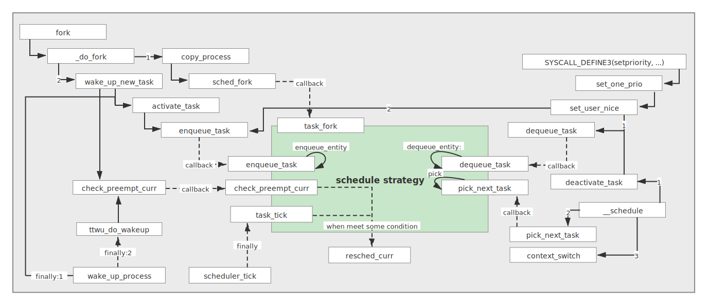

# 从优先级看调度

## Content

- [简介](#简介)
- [优先级的设置](#优先级的设置)
  - [优先级的取值](#优先级的取值)
  - [优先级的类别](#优先级的类别)

- [调度的整体框架](#调度的整体框架)
  - [调度的源头](#调度的源头)
  - [调度的策略与流程](#调度的策略与流程)
    - [调度策略](#调度策略)
    - [调度流程](#调度流程)


---

## 简介

作为一个应用开发人员，涉及进程调度的内容真的不多，其中优先级可能是一个合适的入口。和前面的章节不同，并不是针对遇到的问题，而是针对知识点。因此，本节主要就是从优先级的设置方向了解下进程调度背后的实现方式，否则在设计程序时也无法为应用程序设置合适的优先级。

很多朋友可能在线程的优先级上是知道一些的，因为确实会考虑设置它们的优先级，但是进程却几乎不用设置，因为系统给了大家一个默认的调度器，不过在少数的场合下（对进程响应有更高的要求）也会对其进行设置，这也就是为什么TI公司在设计 [PCD（**P**rocess **C**ontrol **D**aemon）](https://sourceforge.net/p/pcd/code/HEAD/tree) 时将其作为了一个配置项，所以应用开发人员了解进程优先级时很有必要的。

本节参考PCD模块的配置，主要涉及两种调度：*FIFO* 和 *NICE* 。

## 优先级的设置

内核对于应用进程设置自己的运行优先级给了相应的系统调用接口，下面给出的设置优先级的例子是根据 [进程启动](../StartProcess) 的创建进程函数修改而来，这里只截取其中相关的一部分（完整程序在同级的 `code` 文件夹中可以看到）：

```c++
pid = fork();
if (pid < 0) {
    status = -1;
} else if (0 == pid) {
    ...
    /* Setup the priority of the process */
    {
        struct sched_param setParam;
        pid_t self_pid = getpid();
        if (sched_getparam(self_pid, &setParam) == 0) {
            if (NICE == priority->type) {
                setParam.sched_priority = 0;
                sched_setscheduler(self_pid, SCHED_OTHER, &setParam);
                setpriority(PRIO_PROCESS, 0, priority->value);
            } else {
                setParam.sched_priority = priority->value;
                sched_setscheduler(self_pid, SCHED_FIFO, &setParam);
            }
        }
    }
    sigprocmask(SIG_SETMASK, &save_mask, 0L);
    if (execvp(args[1], args + 1) < 0)
        exit(SIGABRT);
    _exit(127); /* exec error */
} else {
#ifndef NO_WAIT
    while (waitpid(pid, &status, 0) < 0) {
        if (errno != EINTR) {
            status = -1; /* error other than EINTR from waitpid() */
            break;
        }
    }
#endif
}
```

可以看到，针对 *NICE* 和 *FIFO* 两种类型，都是调用 `sched_setscheduler` 函数进行设置的，不过设置具体值时，*NICE* 额外调用了 `setpriority` 。

### 优先级的取值

在Linux系统中，*FIFO* 类型的优先级有时也称为实时进程优先级，而 *NICE* 则为非实时进程优先级，其取值范围如下：

|类型|作为参数的范围|内核转换后的范围|
|--|--|--|
|FIFO|0~99|0~99|
|NICE|-20~19|100~139|

参数和内核的转换范围可以跟踪 `setpriority` 系统调用来得到：


其中， `MAX_RT_PRIO` 就定义了最大的实时进程优先级，而真正优先级的范围为 `MAX_PRIO` ，是加上了 *NICE* （非实时进程）优先级所占跨度的结果，值为140。而 *NICE* 的范围也不难通过 `NICE_TO_PRIO` 宏计算出来。

### 优先级的类别

> 实际上，这里所说的 “优先级的类别” 其实就意味着调度器的类别。

通过跟踪 `sched_setscheduler` 系统调用函数就可以看到这个过程：


这里的 `sched_class` 就是调度器类别，它根据优先级的范围进行确定是哪种调度器，从面向对象的角度来看，这是定义了接口的设计模式：


> `rt_sched_class` 和 `fair_sched_class` 就是它的特化实现，前者又称为实时调度，后者又称为CFS（**C**ompletely **F**air **S**cheduler）。

进程的管理模块 `task_struct` 则需要包含/依赖它提供 “规则” 让调度器进行具体调度，如这里截取的四个比较重要的函数：

1. `enqueue_task` ：将进程添加到具体的运行队列；
2. `dequeue_task` ：将进程从运行队列中删除；
3. `pick_next_task` ：选择下一个进行调度的进程；
4. `task_fork` ：用于建立 `fork` 系统调用和调度器之间的关联，每次新进程建立后，就调用该函数通知调度器，但 `rt_sched_class` 并没有实现它，因为 *CFS* 需要做设置虚拟运行时间等准备工作，而实时调度不需要，这也能看出并不是调度类的每个接口具体的调度器都必须实现的。


## 调度的整体框架 

在了解了优先级和与之相关的调度类后，这里将通过整体框架展示下它们在进程调度中的角色：


可以看到，整个调度过程由调度器发起，前面的优先级/调度类都为它提供了调度的策略，它根据这些策略产生的调度结果来唤醒此刻应该被调度的进程。

下面将从程序的维度，来边展示边分析如下几个过程：

1. 触发调度的源头
2. 调度策略的发挥
3. 调度流程的展现

### 调度的源头

下图展示了两种最常见的导致重新调度的情况，一种是**周期性地更新当前任务的状态时**，另一种是**睡眠的任务被唤醒时**。


整个过程可描述如下：

1. 这两种情况都将通过调度策略来进行判断，是否需要发生重新调度，满足条件的情况下会置上重新调度的标志位；

2. 当存在中断恢复/系统调用结束/其他进程主动放弃调度时，会调用 `schedule` 函数，其实现如下：

   ```c
   static __always_inline bool need_resched(void)
   {
   	return unlikely(tif_need_resched());
   }
   ...
   asmlinkage __visible void __sched schedule(void)
   {
   	struct task_struct *tsk = current;
   
   	sched_submit_work(tsk);
   	do {
   		preempt_disable();
   		__schedule(false);
   		sched_preempt_enable_no_resched();
   	} while (need_resched());
   	sched_update_worker(tsk);
   }
   EXPORT_SYMBOL(schedule);
   ```

   函数内部使用 `need_resched` 判断是否需要重新调度时（实际就是判断前面过程设置的 `TIF_NEED_RESCHED` 标志位），将会真正调用 `__schedule` 函数触发真正的调度过程。

### 调度的策略与流程

之所以将策略和流程放在一起，因为它们本来就是一个相互协作的过程，下面的内容更能对此理解深刻。

#### 调度策略

从调度的源头已经可以看到调度策略起到的部分作用了，这里又补充列出了 `fork` 、`setpriority`、`__schedule` 过程对它的依赖，和其名称意义完全相符，它将调度过程中需要做的决策以及决策依赖的数据结构等很好地进行了封装。



以复杂的 *CFS* 为例，这里将对其接口进行进一步的解释：

1. `enqueue_task` 和 `dequeue_task` ：这两个函数作用正好相反，一个是添加 “进程” 到运行队列，一个是从运行队列中删除 “进程”，但这里提到的 “进程” 并不是真正的进程 PCB（**P**rocess **C**ontrol **B**lock，即 `task_struct` 结构），而是调度实体，其关系如下：

   

   所以，在 *CFS* 调度中，是将调度实体们组织成红黑树：当进程变成可运行态或者通过 `fork` 系统调用第一次创建进程时，将添加进红黑树中；当进程阻塞，即进程变成不可运行状态或者当进程终止时，将从红黑树中移除。

2. `pick_next_task`：在前面的调度实体中，存在一个重要成员 *vruntime* ，代表着这个进程的虚拟运行时间，红黑树就是以 *vruntime* 为 Key，存储着任务的情况，下面的代码片段中就展示了红黑树插入的原则：

   ```c
   static inline int entity_before(struct sched_entity *a,
   				struct sched_entity *b)
   {
   	return (s64)(a->vruntime - b->vruntime) < 0;
   }
   ...
   static void __enqueue_entity(struct cfs_rq *cfs_rq, struct sched_entity *se)
   {
   	struct rb_node **link = &cfs_rq->tasks_timeline.rb_root.rb_node;
   	struct rb_node *parent = NULL;
   	struct sched_entity *entry;
   	bool leftmost = true;
   
   	/*
   	 * Find the right place in the rbtree:
   	 */
   	while (*link) {
   		parent = *link;
   		entry = rb_entry(parent, struct sched_entity, run_node);
   		if (entity_before(se, entry)) {
   			link = &parent->rb_left;
   		} else {
   			link = &parent->rb_right;
   			leftmost = false;
   		}
   	}
   
   	rb_link_node(&se->run_node, parent, link);
   	rb_insert_color_cached(&se->run_node,
   			       &cfs_rq->tasks_timeline, leftmost);
   }
   ```

   *vruntime* 是根据优先级进行换算的，当选择下一个要运行的进程时，就会选择具有最小 *vruntime* 的进程：

   ```c
   static struct sched_entity *__pick_next_entity(struct sched_entity *se)
   {
   	struct rb_node *next = rb_next(&se->run_node);
   
   	if (!next)
   		return NULL;
   
   	return rb_entry(next, struct sched_entity, run_node);
   }
   ```

   从实现可以看出，将选择红黑树最左侧节点作为下一个调度实体。

3. `task_tick` ：该函数最终调用到 `check_preempt_tick` ，用于检测进程运行时间，防止某个进程运行时间过长，在时间超出预期时将通知调度器需要重新进行调度：

   ```c
   static void
   check_preempt_tick(struct cfs_rq *cfs_rq, struct sched_entity *curr)
   {
   	unsigned long ideal_runtime, delta_exec;
   	struct sched_entity *se;
   	s64 delta;
   
   	ideal_runtime = sched_slice(cfs_rq, curr);
   	...
   	se = __pick_first_entity(cfs_rq);
   	delta = curr->vruntime - se->vruntime;
   
   	if (delta < 0)
   		return;
   
   	if (delta > ideal_runtime)
   		resched_curr(rq_of(cfs_rq));
   }
   ```

   截取片段的判断即反映了上述过程。

4. `check_preempt_curr`：和 `task_tick` 最终都有可能走到重新调度，但这个接口则是检测唤醒的进程是否需要抢占当前运行的进程，如实时进程对非实时进程的抢占：

   ```c
   /*
    * Preempt the current task with a newly woken task if needed:
    */
   static void check_preempt_curr_rt(struct rq *rq, struct task_struct *p, int flags)
   {
   	if (p->prio < rq->curr->prio) {
   		resched_curr(rq);
   		return;
   	}
   }
   ```

   > 注意，当实时唤醒抢占非实时是走的实时调度类的 `check_preempt_curr` 。

5. `task_fork`：可以理解为进程虚拟时间的初始化，这里就不贴代码片段了，感兴趣的朋友可以去看下源码。

#### 调度流程

从上一小节的图中可以看到 `__schedule` 调度流程所做的几件事情：

1. `deactivate_task` 执行时机：

   ```c
   if (!preempt && prev->state) {
       if (signal_pending_state(prev->state, prev)) {
           prev->state = TASK_RUNNING;
       } else {
           deactivate_task(rq, prev, DEQUEUE_SLEEP | DEQUEUE_NOCLOCK);
   
           if (prev->in_iowait) {
               atomic_inc(&rq->nr_iowait);
               delayacct_blkio_start();
           }
       }
       switch_count = &prev->nvcsw;
   }
   ```

   即在非内核抢占且当前进程不处于运行状态时，如果当前进程存在待处理的信号，要将这个任务状态设置成 `TASK_RUNNING` ，没有则调用 `deactivate_task`，将当前进程从队列中删除。

2. 调用 `pick_next_task` 通过调度策略选择下一个将执行的进程。

3. 调用 `context_switch` 完成进程的切换，其中主要包括：

   - CPU的所有寄存器中的值

   - 进程的状态

   - 进程的堆栈

   这些也称为进程的上下文（*context*），在进程切换和中断时都将进行保存，以便中断结束/进程再次得到CPU时能够正常恢复，这个过程基本涵盖在各个平台汇编实现的 `switch_to` 子函数上了。


