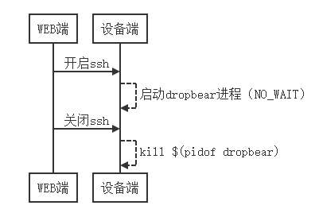

# 令人抓狂的sh进程

> 文章最后有[彩蛋](#补充知识点)哟 :heart_eyes:

拉起某个进程在linux应用开发中是不可避免的，通常有如下几种方式：

- system
- popen
- fork+exec类函数

这三种方式在工程应用上都比较常见，但很多时候启动自己想要的进程后往往会增加一个`sh`进程，在嵌入式系统上有时候会显示为全名`sh -c xxx`。这种情况下，无论是资源还是调度都是存在浪费的。若你还具有强迫症，发现无论如何都消除不了它，那么这无疑更是令人抓狂的。

在code文件夹中，已经给出了相关的例程代码，使用`sh build.sh`即可完成编译。除此之外，还提供了glibc中关于`system`和`popen`的源码（glibc的下载地址 http://ftp.gnu.org/pub/gnu/glibc/ ，这里给出了两个版本，当前自己运行的ubuntu是2.27的，而最新的是2.32，两者实现是有差异的，感兴趣可以继续深挖下）。

```C
int main()
{
#if defined(USE_SYSTEM)
    system("./process");
#elif defined(USE_POPEN)
    FILE *fp = popen("./process", "w");
    if (fp == (void *)0)
        return -1;
    pclose(fp);
#else
    CreateProcess("./process"); //fork+execl
#endif
    while (1);
    return 0;
}
```

上面给出的是父进程代码的截取，对应main.c，从代码上看，这就是一些再正常不过的启动进程的函数（CreateProcess函数是经过封装的，内部即为fork+execl实现），而启动的进程就是process.c编译出的process进程，代码结构更为简单：

```C
while (1) {
    printf("Process is running...\n");
    sleep(10);
}
```

仅仅是循环打印，下面不妨走一遍运行：

```c
$ ps
  PID TTY          TIME CMD
 1595 tty1     00:00:03 bash
 9386 tty1     00:00:00 ps
$ sh build.sh
$ ./main &
[1] 9399
Process is running...
$ ps
  PID TTY          TIME CMD
 1595 tty1     00:00:03 bash
 9399 tty1     00:00:00 main
 9400 tty1     00:00:00 sh
 9401 tty1     00:00:00 process
 9402 tty1     00:00:00 ps
```

正如标题所说的，确实比预期的多出现了一个`sh`进程，实际上走读相关的源码就可以知道，出现它的原因在于，不管是上面提到的哪种启动进程方式，都会调用`sh -c`去拉起进程（使用`-c`能将字符串完整执行，若字符串中包含多个命令也能逐一进行解析并执行）。而且通过`kill $(pidof process)`不难发现，在`process`结束后，`sh`也将不复存在。但是，已经拉起来process的情况下是不再需要`sh`的，为何它依然存在？好在linux上有`strace`工具可以对内部逻辑进行进一步的窥探：

```c
------------------------------------shell-1----------------------------------------------
$ strace -f ./main
execve("./main", ["./main"], 0x7fffff84b1f8 /* 19 vars */) = 0
...
clone(strace: Process 9450 attached
child_stack=NULL, flags=CLONE_CHILD_CLEARTID|CLONE_CHILD_SETTID|SIGCHLD, child_tidptr=0x7f721faf1790) = 9450
[pid  9450] rt_sigaction(SIGINT, {sa_handler=SIG_DFL, sa_mask=[], sa_flags=SA_RESTORER, sa_restorer=0x7f721f43f040},  <unfinished ...>
[pid  9449] wait4(9450,  <unfinished ...>
[pid  9450] <... rt_sigaction resumed> NULL, 8) = 0
[pid  9450] rt_sigaction(SIGQUIT, {sa_handler=SIG_DFL, sa_mask=[], sa_flags=SA_RESTORER, sa_restorer=0x7f721f43f040}, NULL, 8) = 0
[pid  9450] rt_sigprocmask(SIG_SETMASK, [], NULL, 8) = 0
[pid  9450] execve("/bin/sh", ["sh", "-c", "./process"], 0x7fffc9f56178 /* 19 vars */) = 0
...
[pid  9450] clone(strace: Process 9451 attached
child_stack=NULL, flags=CLONE_CHILD_CLEARTID|CLONE_CHILD_SETTID|SIGCHLD, child_tidptr=0x7ff3fb031810) = 9451
[pid  9451] execve("./process", ["./process"], 0x7ff3fb41fb30 /* 19 vars */ <unfinished ...>
[pid  9450] wait4(-1,  <unfinished ...>
[pid  9451] <... execve resumed> )      = 0
...
[pid  9451] write(1, "Process is running...\n", 22Process is running...
) = 22
[pid  9451] nanosleep({tv_sec=10, tv_nsec=0}, 0x7fffc114bb90) = 0
[pid  9451] write(1, "Process is running...\n", 22Process is running...
------------------------------------shell-2----------------------------------------------
$ top
...
9449 callon    20   0   10416    444    424 S   0.0  0.0   0:00.00 main
9450 callon    20   0   10668    672    644 S   0.0  0.0   0:00.00 sh
9451 callon    20   0   10548    540    436 S   0.0  0.0   0:00.00 process
...
```

通过跟踪系统调用可以发现，在执行`./main &`后：

- 进程main卡在`wait4`，等待sh进程结束
- 进程sh卡在`wait4`，等待process进程结束
- 进程process却完全不知情地在反复打印

所以，想要结束这段一厢情愿地等待，唯有process主动分身：

```C
int main()
{
    int pid = fork();
    if (pid < 0) {
        perror("fork failed!\n");
    } else if (pid == 0) {
        setsid();
        chdir("/");
        while (1) {
            printf("Process is running...\n");
            sleep(10);
        }
    } else {
        //father stop here
    }
    return 0;
}
```

这里贴出了一种修改方案，是将process最终作为守护进程运行：process启动子进程来做自己喜欢的事情，脱离原本“父母”的怀抱，这样sh将完成`wait`而退出，从而main也能完成`wait`，进入后面的`while`循环。

实际上，在工程上还有另一种失误也很容易犯，那就是忽视了`wait`的重要性：

```C
if ((pid = fork()) < 0) {
    status = -1; /* probably out of processes */
} else if (pid == 0) { /* child */
    /* restore previous signal actions & reset signal mask */
    sigaction(SIGINT, &saveintr, NULL);
    sigaction(SIGQUIT, &savequit, NULL);
    sigprocmask(SIG_SETMASK, &savemask, NULL);
    execl("/bin/sh", "sh", "-c", cmdstring, (char *)0);
    _exit(127); /* exec error */
} else { /* parent */
#ifndef NO_WAIT
    while (waitpid(pid, &status, 0) < 0) {
        if (errno != EINTR) {
            status = -1; /* error other than EINTR from waitpid() */
            break;
        }
    }
#endif
}
```

如上代码就是main.c中`CreateProcess`启动进程的部分，这里其实不管是否调用`waitpid`，都会产生`sh`这个进程，但是若不调用则后果将来得更严重。如下为一种可能的场景：



在类似这种场景下，若`dropbear`的启动是NO WAIT的，那么在ssh关闭即杀掉`dropbear`进程后，sh将转变为僵尸进程，这意味着该进程虽然不再会被调度，但是在内核的角度其内核保留的资源依然存在（虽然很少）。在linux中，若父进程不调用`wait`对子进程进行回收，那么子进程结束后，就会转变为僵尸进程而依然会在`ps`命令中显示，且标注为`defunct`。

```c
$ sh build.sh
$ ./main &
[1] 9496
Process is running...
$ ps
  PID TTY          TIME CMD
 1595 tty1     00:00:04 bash
 9496 tty1     00:00:01 main
 9497 tty1     00:00:00 sh
 9498 tty1     00:00:00 process
 9499 tty1     00:00:00 ps
$ kill 9498
Terminated
$ ps
  PID TTY          TIME CMD
 1595 tty1     00:00:04 bash
 9496 tty1     00:00:08 main
 9497 tty1     00:00:00 sh <defunct>
 9500 tty1     00:00:00 ps
```


---

## 补充知识点1

实际上，无需 `fork` 子进程就能避免 `sh -c` 进程的方法还有：

```diff
int main()
{
#if defined(USE_SYSTEM)
    system("./process");
#elif defined(USE_POPEN)
    FILE *fp = popen("./process", "w");
    if (fp == (void *)0)
        return -1;
    pclose(fp);
#else
-    CreateProcess("./process"); //fork+execl
+    CreateProcess_ex("./process"); //fork+execvp
#endif
    while (1);
    return 0;
}
```

其实深入想想，在shell下既然执行main进程的时候只需要 `./main &` 就行，也没产生什么 `sh -c` 进程，那么一定是还存在一种方式可以保证只起单一目标进程的，不妨先验证下：

```shell
$ ps
  PID TTY          TIME CMD
  293 tty2     00:00:02 bash
  741 tty2     00:00:00 main
  742 tty2     00:00:00 process
  743 tty2     00:00:00 ps
```

`CreateProcess_ex` 在 main.c 中也给出了，其原理其实就是将`sh -c` 的过程展开在了源码中，这其中包含解析shell环境变量、解析重定向输出和传递通用参数三个环节。


---

## 补充知识点2

若需要在工程应用上封装启动进程的函数，那么父子进程的信号处理需要额外关注。在 `CreateProcess` 和 `CreateProcess_ex` 函数都可以看到这部分，总结下来有四点：

1. 父进程需要忽略`SIGINT`和`SIGQUIT`
2. 父进程需要阻塞`SIGCHLD`
3. 子进程需要代替父进程恢复`SIGINT`和`SIGQUIT`
4. `wait`结束后，恢复父进程对`SIGINT`和`SIGQUIT`的处理

如上四点，其实只要弄清楚两个，另外两个也就不言而喻了

- 阻塞`SIGCHLD`：其目的在于，若之前父进程已经注册了`SIGCHLD`的信号处理函数，在信号处理函数中调用`wait`，而`CreateProcess`中又调用了`waitpid`，则可能先调用了`wait`导致`waitpid`返回`ECHILD`的失败，这不是我们所希望的。

- 忽略`SIGINT`和`SIGQUIT`信号：其目的在于，`CreateProcess`的执行命令可能是交互命令（`如ed程序`），以及`CreateProcess`的调用者在命令执行期间放弃了对程序的控制，所以`CreateProcess`调用者不应该接收`SIGINT`和`SIGQUIT`，而应由子进程接收。

  

有相关需要封装启动进程类似“轮子”的小伙伴，不妨研究下glib库（下载地址为 https://ftp.acc.umu.se/pub/GNOME/sources/glib/ ），虽然网上对它褒贬不一，但不妨碍肯定它是一个非常优秀的C语言库，它将C语言与面向对象思想结合地非常完美，很值得研究和借鉴。对于启动进程而言，它封装的`g_spawn_async`（也在本节code文件夹中给出了源码）既考虑到了信号处理的方方面面，又提供了本节所述的后台运行方式，可以大大降低自己封装的工作量和风险。


